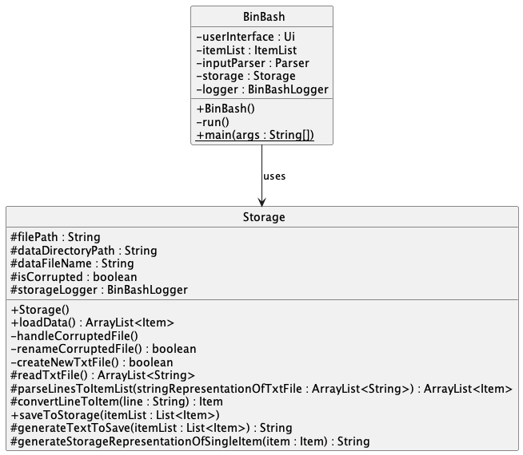
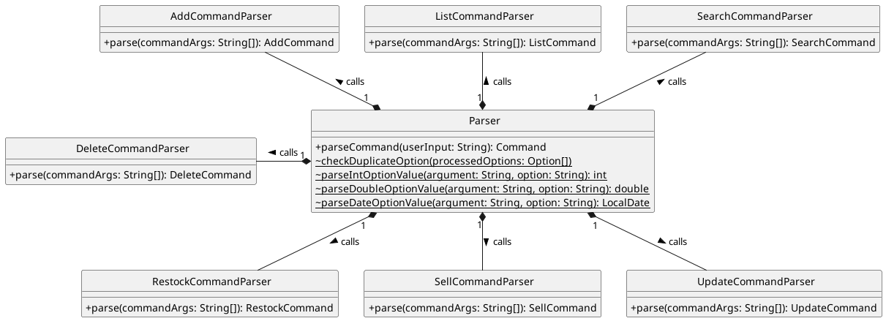
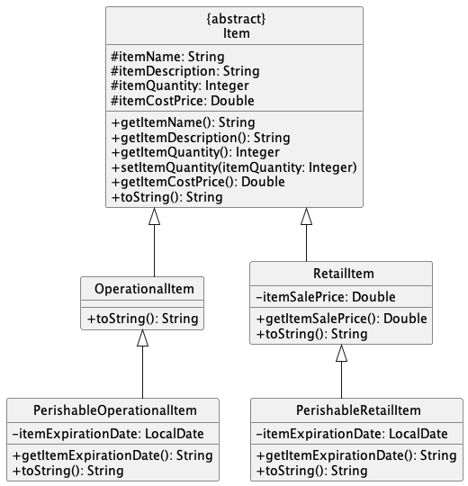
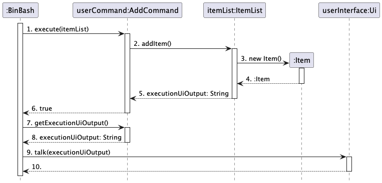

# Developer Guide

## Table of Contents

* [Acknowledgements](#acknowledgements)
* [Setting up, getting started](#setting-up-getting-started)
* [Design](#design)
    * [Architecture](#architecture)
    * [Ui Component](#ui-component)
    * [Storage Component](#storage-component)
    * [Parser Component](#parser-component)
    * [Command Component](#command-component)
    * [Data Component](#data-component)
* [Features](#features)
  * [Add Item to Inventory](#add-item-to-inventory)
  * [List all items in inventory](#list-all-items-in-inventory)
  * [Delete Item](#delete-item)
  * [[Proposed] Search by universal fields](#proposed-search-by-universal-fields)
  * [Logging](#logging)
* [Product scope](#product-scope)
  * [Target user profile](#target-user-profile)
  * [Value proposition](#value-proposition)
* [User Stories](#user-stories)
* [Non-Functional Requirements](#non-functional-requirements)
* [Glossary](#glossary)
* [Instructions for manual testing](#instructions-for-manual-testing)

## Acknowledgements

[AB3 Developer Guide](https://se-education.org/addressbook-level3/DeveloperGuide.html)

[AB3 GitHub Project Repository](https://github.com/se-edu/addressbook-level3)

## Setting up, getting started

1. Ensure you have Java `11` and above. If you do not have the required version, you can install the Java `11` JDK from this [link](https://www.oracle.com/sg/java/technologies/javase/jdk11-archive-downloads.html).
2. **Fork** the BinBash repository [here](https://github.com/AY2324S2-CS2113T-T09-2/tp).
3. **Clone** the fork into your computer. 

> Note: It is recommended to use `IntelliJ IDEA` for the remaining steps.

If you are using `IntelliJ IDEA`,

1. Set up the correct JDK version for IntelliJ. To do this, kindly refer to the official documentation from JetBrains [here](https://www.jetbrains.com/help/idea/sdk.html#set-up-jdk).
   1. Ensure that you are using **JDK version 11**. 
2. Import the project as a **Gradle** project.:q
   1. Click **Open** or **Import** in IntelliJ. 
   2. Locate the `build.gradle` file in the repository. Select it, and click OK.
   3. If prompted, choose to **Open as Project**. 
   4. Click OK to accept the default settings. 
   5. Wait for the import process to finish. This could take a few minutes.
   6. Once the importing process has completed, you should see the `Gradle Toolbar` in the IDEA interface (look for the elephant icon on the right side of your screen). 
3. Verify that the Gradle project has been set up correctly.
   1. Run `seedu.binbash.BinBash` and ensure you see the following output.<br>
       ```text
       -------------------------------------------------------------
        ____  _       ____            _
       | __ )(_)_ __ | __ )  __ _ ___| |__
       |  _ \| | '_ \|  _ \ / _` / __| '_ \
       | |_) | | | | | |_) | (_| \__ \ | | |
       |____/|_|_| |_|____/ \__,_|___/_| |_|
    
       Welcome to BinBash!
       -------------------------------------------------------------
       -------------------------------------------------------------
       Here are your metrics:
       Total Cost: 0.00
       Total Revenue: 0.00
       Net Profit: 0.00
    
       -------------------------------------------------------------
       ```
   2. Click on the Gradle icon.
   3. Run the tests (click on `tp/Tasks/verification/test`) and ensure that all tests have passed.

## Design

### Architecture


The Architecture Diagram given above explains the high-level design of the application.
Given below is a quick overview of the main components and how they interact with each other.

#### Main components of the architecture

`BinBash` serves as the entry-point of the application. 
During application startup, `BinBash` initializes the other components and connects them with each other.

The bulk of the app's work is done by the following five components:

- `Ui`: The UI of the App.
- `Storage`: Reads data from, and writes data to an `items.txt` file.
- `Parser`: Makes sense of the user input to return the appropriate command.
- `Command`: Executes the command requested by the user.
- `Data`: Handles the data created by the user.

The `Logger` component handles the logging of events, and writes logs to a `logs.txt` log file.

The user primarily interacts with the `Ui` component.
In turn, the `Parser` interprets the user's input and creates the appropriate `Command`.
The `Data` component then manages all data created by the user upon `Command` execution.
The `Storage` component handles the storage and loading of saved user data.

#### How the architecture components interact with each other

The **Sequence Diagram** below shows how the components interact with each other for the scenario where the user issues the command `list`.


1. User enters the command `list` to the `Ui`.
2. `Ui` passes the command as a string through the method `readUserInput('list')`, called via `BinBash`.
3. `BinBash` passes the string to `Parser` through the method `parseCommand('list')`.
4. `Parser` returns a new `Command` object. (In this specific case, it would be a ListCommand object)
5. `BinBash` calls the `execute()` method of `Command`.
6. `Command` then interacts with `ItemList`, and calls the relevant method.
7. `ItemList` returns the executionUiOutput, in the form of a String object. 
8. `BinBash` calls the `getExecutionUiOutput` command in `Command`
9. `Command` returns the outputString, in the form of a String object.
10. `BinBash` calls the `talk()` method in `Ui`, and passes the outputString.
11. `Ui` prints this outputString to the user.
12. If the `Command` executed modifies the database, `BinBash` will call the `saveToStorage()` method of `Storage`

### Ui Component


API: [`Ui.java`](https://github.com/AY2324S2-CS2113T-T09-2/tp/blob/master/src/main/java/seedu/binbash/ui/Ui.java)

The above class diagram shows the components delegating separate functionalities of the Ui.

The `TextIn` class is responsible for reading user input and returning it to `Ui`, upon which it is passed to the *main()* program.

The `PrintStream` class writes text at the behest of `Ui` to standard output, upon which it is received by the user.

Note the use of an externally provided `LineReader` object in the `TextIn` class that handles input. This allows us to greatly extend our text-based user interface with features such as:

1. Command completion on tab

2. Displaying option descriptions on hover

3. Contextual help menus


This allows us to overload options on a small number of commands to provide full functionality of the application. Developers can then extend its features without also the worry of finding a way for users to access those features easily.

### Storage Component



<!-- TODO: Link storage API -->

#### Overview
The `Storage` class is responsible for managing storage operations for the BinBash application. It performs critical 
functions such as loading and saving item data, handling corrupted files, and maintaining the integrity of the 
application's persistent data.

#### Key Responsibilities
- **Loading Data**: The `loadData()` method reads from `items.txt` and constructs a list of `Item` objects.
- **Saving Data**: The `saveToStorage(List<Item> itemList)` method writes the current state of `Item` objects to `items.txt`.
- **Corruption Handling**: If data corruption is detected, `handleCorruptedFile()` attempts to recover by renaming the corrupted file and creating a new one.
- **Data Parsing**: The class contains methods for parsing data from and to the storage format, specifically `parseLinesToItemList(ArrayList<String>)` and `generateStorageRepresentationOfSingleItem(Item)`.


### Parser Component



API: [`Parser.java`](https://github.com/AY2324S2-CS2113T-T09-2/tp/blob/master/src/main/java/seedu/binbash/parser/Parser.java)

The `Parser` component plays a vital role in interpreting user input and facilitating interaction with the application. It serves as the bridge between user commands and actionable operations within the system. Here's an overview of its functionalities:

- **Command Interpretation**: The `Parser` analyzes user input to identify the corresponding commands and parameters, ensuring accurate command interpretation.

- **Command Delegation**: Once user commands are identified, the `Parser` delegates command execution to the appropriate command handlers, ensuring seamless operation flow.

- **Error Handling**: In cases of invalid or malformed input, the `Parser` provides informative error messages, guiding users towards correct command usage.

- **Integration Support**: Designed with modularity in mind, the `Parser` facilitates integration with other system components, promoting extensibility and maintainability.

By effectively parsing user commands and translating them into actionable tasks, the `Parser` enhances the overall usability and functionality of the application.

Below shows the sequence diagram of a `Parser` parsing user input, to return the corresponding `Command`.


Here, it is assumed that the user has already provided their input to the `Ui`. 
Then, `BinBash` retrieves this input and passes it to `Parser`.
The `Parser` will then process the user input to determine the type of command to be created.

From here, `Parser` will self-call its corresponding `parseXYZCommand()` method.
Upon calling `parseXYZCommand()`, the `parse()` method of an internal `XYZCommandParser` is invoked, to create the appropriate `Command` (an `XYZCommand` in this case).
> In some instances, if the command that needs to be created is simple enough (e.g., a `ByeCommand`), then `Parser` will directly create the `Command` without the need of an `XYZCommandParser`.

The `XYZCommand` is then subsequently returned back to `BinBash` for code execution.

### Command Component


<!-- TODO: Link command API -->

The command classes within the `seedu.binbash.command` package form the command pattern that encapsulates all user 
commands. Each command represents a single operation or action that can be performed by the BinBash application.

#### Core Class: `Command`

- `Command` is an abstract class that serves as a template for all other command classes.
- It declares the method `execute(ItemList itemList)` that must be implemented by all subclasses to carry out the command-specific logic.
- It provides common fields such as `itemList`, `commandLogger`, `executionUiOutput`, and `hasToSave` which facilitate logging, output generation, and indicating if the application state needs to be saved post-execution.

#### Subclasses of `Command`

- `AddCommand`: Handles the addition of new items to the inventory.
- `ByeCommand`: Signals the application to shut down.
- `DeleteCommand`: Removes items from the inventory by index or name.
- `ListCommand`: Lists all items currently in the inventory.
- `ProfitCommand`: Calculates and displays the total profit.
- `RestockCommand`: Adds stock to an existing item in the inventory.
- `SearchCommand`: Searches for items in the inventory based on specified criteria.
- `SellCommand`: Records the sale of items and adjusts the inventory accordingly.
- `UpdateCommand`: Updates the details of an existing item in the inventory.

#### Command Execution Flow

1. `BinBash` main class receives user input.
2. `Parser` interprets the input and creates an instance of the appropriate `Command` subclass.
3. The `execute` method of the created `Command` object is called by `BinBash`.
4. If `hasToSave` is true post-execution, `BinBash` triggers the `Storage` class to save the current state.

### Data Component


API: [`Inventory`](https://github.com/AY2324S2-CS2113T-T09-2/tp/blob/master/src/main/java/seedu/binbash/inventory),
[`Item`](https://github.com/AY2324S2-CS2113T-T09-2/tp/blob/master/src/main/java/seedu/binbash/item)

The `Data` component is responsible for the management of user data during application runtime.

At its core, an `ItemList` will store, and operate on different types of `Item`.
The operations that are done on `Item` are dictated by their associated `Command`.
For instance, the execution of `AddCommand` will entail the creation and storage of a new `Item` object in `ItemList`.
If `SearchCommand` is executed to search through the `ItemList`, the search task will be delegated to the `SearchAssistant`.



Within this component, there are also multiple types of `Item` that can be created, stored and modified.
The four primary types of `Item` are `RetailItem`, `OperationalItem`, `PerishableRetailItem`, and `PerishableOperationalItem`.

## Features

### Add Item to Inventory



API: [`AddCommand.java`](https://github.com/AY2324S2-CS2113T-T09-2/tp/blob/master/src/main/java/seedu/binbash/command/AddCommand.java)

The `add` command adds an `Item` to the `ItemList` object. A formatted `executionUiOutput` message which states the name, description,
quantity, expiration date, sale price, and cost price entered for the newly created item, will also be printed out upon successful
command execution.

When the `execute()` method from `AddCommand` class is called, the `addItem()` method is called in turn. A new `Item` object
will firstly be created based off the user's input. For instance, the user can choose to create a `RetailItem`, `PerishableRetailItem`,
`OperationalItem` or `PerishableOperationalItem`, depending on their needs. This new `Item` object is then added to the
`ItemList`, and the formatted `executionUiOutput` will be returned to the `AddCommand`.

`BinBash` will then retrieve the `executionUiOutput` from the `AddCommand`, and call the `Ui` class to print out this 
message using the `talk()` method.

Separation of Concerns is applied to ensure the `Ui` is only responsible for printing the messages to output, while the 
`ItemList` class deals with the logic of creating and adding an item to the list. This implementation also encapsulates the details 
of adding an item and displaying messages. This way, only classes relevant to the logic of adding an item will have 
access to `ItemList`.

### List all items in inventory


API: [`ListCommand.java`](https://github.com/AY2324S2-CS2113T-T09-2/tp/blob/master/src/main/java/seedu/binbash/command/ListCommand.java)

The `ListCommand` class is designed to handle the operation of listing all items in the inventory. When the `execute()`
method is called, it retrieves the complete list of items from the `ItemList`
and assigns it to `executionUiOutput`.

A sorting functionality is implemented within the `list` command. Depending on which flag is set, the list of 
`Items` retrieved will be sorted in a certain order based on the specified flags.

- `list` retrieves the list of `Item` without sorting.
- `list -c` retrieves the list of `Item` sorted based on `itemCostPrice` value.
- `list -e` retrieves the list of `Item` sorted based on `itemExpirationDate` value. Only items of the `PerishableOperationlItem` and `PerishableRetailItem` classes are retrieved.
- `list -p` retrieves the list of `Item` sorted based on `totaRevenue - totalCost` value. Only items with of the `RetailItem` class are retrieved.
- `list -s` retrieves the list of `Item` sorted based on `itemSalePrice` value. Only items of the `RetailItem` class are retrieved.

The `ListCommand` has two constructors, `ListCommand()` and `ListCommand(SortOptionEnum)`, the former is used when no sorting
is specified, the latter is used when the list is to be sorted where `SortOptionEnum` will be the type of sorting used.
The `ListCommand()` constructor will set the `sortOption` varialbe to `SortOptionEnum.NONE` while the `ListCommand(SortOptionEnum)`
will set `sortOption` based on the `SortOptionEnum` value passed into hte constructor.

The enum `SortOptionEnum` contains four values `NONE`, `EXPIRY`, `SALE`, `COST`, `PROFIT`
- `NONE` List not to be sorted
- `EXPIRY` List sorted based on `itemExpirationDate` value.
- `SALE` List sorted based on `itemSalePrice` value.
- `COST` List sorted based on `itemSalePrice` value.
- `PROFIT` List sorted based on `totaRevenue - totalCost` value.

When the `execute(ItemList)` method is called, it first retrieves a `List` from the `ItemList` object passed that will
contain all `Item` objects in the inventory. The execution will then defer depending on the `sortOption` value, which 
can be referenced in the sequence diagram provided above.

To ensure that the index of items in the printed list can be used as `ITEM_INDEX` values for the `update`, `delete`, 
`sell` and `restock` commands, an `ArrayList<Integer>` called `sortedOrder` will be used to map the indexes of the 
items printed to their indexes in `itemList`. `sortedOrder` will be updated on startup, adding of items, deleting of 
items, and listing of items to ensure that the mapping is always accurate when it is referenced.

#### Implementation Notes ####
The ListCommand is concerned only with the execution of the listing operation. It follows a straightforward process that relies on the `ItemList` to format the list of items, ensuring separation of concerns between command execution and UI presentation.

### Delete Item

TODO: Sequence diagram of DeleteCommand

The `delete` command deletes an object of the `Item` class or any of its subclasses from the inventory list and 
prints a formatted message stating the details of the items that was deleted. 

The constructor of the `DeleteCommand` class is overloaded and its behavior differs based on what search parameter is 
entered. The possible constructors are:

* `DeleteCommand(int index)`: This constructor is used if the search parameter is an `Integer`. The `isIndex` variable will be set to true, which indicates that an item should be removed by matching its `index`.
* `DeleteCommand(String keyword)`: This constructor is used if the search parameter is a `String`. Conversely, the `isIndex` variable will be set to false, which indicates that an item should be removed by matching its `name`.

When the `execute()` method from `DeleteCommand` class is called, it first checks whether the search parameter entered
is an `Integer` or a `String` using the `isIndex` variable. Once the search parameter is checked, it calls the
`deleteItem` method of the `ItemList` object passed as a parameter to the `execute()` method.

Similar to the `DeleteCommand` constructor, the `deleteItem` method of the `ItemList` class has different behaviors 
based on the data type of the parameter passed. The implementation is done by overloading the `deleteItem` method and
having one `deleteItem` method take in an `Integer` and another taking in a `String`.
* If the parameter is an `Integer`, the `deleteItem(int index)` method will call the `remove` method of the `ArrayList` class to
remove the item from the inventory list.
* If the parameter is a `String`, the `deleteItem(String keyword)` method will run a `for` loop to iterate through the `ArrayList`
until it finds a `Item` object whose name `equals` to that of the search parameter. If an `Item` object has matching
names with the search parameter, it will store the index in the `targetIndex` variable. This `deleteItem(String keyword)` method will
then call another `deleteItem(int index)` method, but this time, the parameter passed is an integer. The execution after this
will be exactly the same as passing an `Integer` to the `deleteItem(int index)` method mentions above.

Upon completion of either operation, the `execute()` method sets the `hasToSave` flag to true, signaling the need to persist changes to storage. This entire process is logged at various levels, providing a trail for audit and debugging purposes.

#### Implementation Notes ####
The design of `DeleteCommand` is such that it encapsulates the delete operation, separating concerns by handling the logic of deletion internally and interacting with `ItemList` without exposing the details of the list's data structure. This modular approach simplifies the responsibilities of the `Parser` and `BinBash` (main) components, which do not need to understand the internals of the delete operation, thereby adhering to the principles of high cohesion and low coupling.

Additionally, the decision to use two constructors promotes the Single Responsibility Principle, as each constructor's logic is tailored to the type of deletion it handles.

### Search command


The search command calls on methods in the SearchAssistant class to perform queries.


Each method searches through a corresponding field.
If the argument to this method is found to be a certain default value (MIN/MAX values for numerical arguments and empty strings for string arguments), searching through this field is skipped.

Note that search relies on the SearchAssistant having the full item list to produce correct results.
This is guaranteed in this case by ItemList's setFoundItems() call.

After obtaining the list of found items, it then uses printList to convert this list into a user friendly string.

## Logging

Logging plays a crucial role in providing insights into the runtime behavior of the application and diagnosing issues. In this project, we utilize the `java.util.logging` package for comprehensive logging functionality.

### BinBashLogger Class

The `BinBashLogger` class serves as the central component for managing all logging-related operations within the application. It encapsulates the functionality provided by the `java.util.logging` package, offering a streamlined interface for logging operations.

### Usage

To integrate logging into a class, developers can obtain a `Logger` instance by constructing a `BinBashLogger` object and assigning it as a class-level variable. This allows for consistent and centralized logging across the entire codebase.

### Log Output

By default, log messages are directed to a `logs.txt` file located in the `/logs/` directory. This structured approach ensures that log data is organized and easily accessible for analysis and troubleshooting purposes.

In cases where issues arise with the `logs.txt` file and no `logs` are being written, warning logs are automatically redirected to the console for immediate visibility. This fallback mechanism ensures that critical information is not lost and allows developers to promptly address any logging-related issues.

Overall, effective logging implementation enhances the maintainability, reliability, and diagnosability of the application, facilitating smooth operation and efficient issue resolution.

## Product Scope

### Target User Profile

* **Retail Shop Owners**: Individuals who operate retail businesses and require efficient inventory management solutions.
* **Preference for Desktop Apps**: Users who prefer desktop applications over other software types due to reliability and familiarity.
* **Proficient Typists**: Individuals who can type quickly and accurately, facilitating efficient interaction with the application.
* **Preference for Typing**: Users who prefer typing to mouse interactions for increased speed and productivity.
* **Comfortable with CLI Apps**: Users who are reasonably comfortable using command-line interfaces (CLI) for software interaction.

### Value Proposition

* **Efficient Inventory Management**: Our solution enables retail shop owners to manage their inventory more efficiently compared to manual methods and traditional GUI-driven apps, reducing time and errors.
* **Cross-Platform Portability**: Our application runs seamlessly on various operating systems such as Windows, Linux, and macOS, providing flexibility and accessibility across different platforms.
* **Lightweight and Resource-Efficient**: Designed to be lightweight, our application requires only entry-level hardware to operate efficiently, ensuring minimal system resource usage and optimal performance.

## User Stories

| Version | As a ...   | I want to ...                                                            | So that I can ...                                                                 |
|---------|------------|--------------------------------------------------------------------------|-----------------------------------------------------------------------------------|
| v1.0    | shop owner | add new items to my inventory                                            | track them in the application                                                     |
| v1.0    | shop owner | delete items from my inventory                                           | remove items that I no longer sell, and keep the inventory list current           |
| v1.0    | shop owner | search for items in my inventory by name                                 | find these items quickly                                                          |
| v1.0    | shop owner | see a list of all my items                                               | get a better understanding of my current inventory status                         |
| v1.0    | shop owner | record the cost and sale prices of items                                 | track my investment and calculate profit margins                                  |
| v1.0    | shop owner | receive visible feedback when I execute commands                         | know whether my command was executed successfully or not                          |
| v1.0    | shop owner | save my inventory list to my local storage                               | exit the program without loss of data, and continue working on it at a later time |
| v2.0    | shop owner | update the quantity of existing items when I restock                     | ensure that inventory levels are accurate                                         |
| v2.0    | shop owner | reduce the quantity of items when they are sold                          | keep my inventory levels updated                                                  |
| v2.0    | shop owner | categorize items in my inventory by type                                 | organize my stock better, and know which item is which                            | 
| v2.0    | shop owner | view my overall lifetime profit margins                                  | analyze my sales volumes and know if I am profiting or incurring a loss           |
| v2.0    | shop owner | set a minimum stock level for items                                      | be alerted when stock is low                                                      | 
| v2.0    | shop owner | receive notifications when an item's stock level falls below its minimum | restock in time                                                                   | 
| v2.0    | shop owner | have ease of command input (autocompletion, view command history etc.)   | quickly and efficiently type in my commands                                       |
| v2.0    | shop owner | search through my inventory using more fields and search terms           | effectively review the items in my inventory, using more specific search terms    |
| v3.0+   | shop owner | access inventory reports                                                 | analyze stock levels over time                                                    | 
| v3.0+   | shop owner | view the history of stock adjustments for an item                        | track its sales and restocking events                                             |
| v3.0+   | shop owner | see which items are most frequently restocked or sold                    | identify popular products                                                         |

## Non-Functional Requirements

1. **Command Auto-Suggestion**: The application shall provide auto-suggestions for commands as users type, enhancing the command entry process and speeding up user interaction.

2. **Out-of-Order Command Entry**: Users shall be allowed to enter commands out-of-order, while still ensuring that all required arguments are provided. This flexibility in command entry improves user experience and accommodates different usage patterns.

3. **Offline Functionality**: The application shall seamlessly function offline without any dependency on external services or internet connectivity. Users can continue to use all core features and functionalities even when disconnected from the internet, ensuring uninterrupted operation and productivity.

## Glossary

* **Desktop Application**: A software program designed to run on a personal computer or workstation, providing functionality and features tailored to desktop computing environments.

* **CLI (Command-Line Interface)**: A text-based user interface used to interact with software applications by entering commands into a terminal or command prompt.

* **Cross-Platform Compatibility**: The ability of software applications to run seamlessly on multiple operating systems without requiring modification or adaptation.

* **GUI (Graphical User Interface)**: A visual interface that allows users to interact with software applications using graphical elements such as windows, icons, buttons, and menus.

* **Portability**: The ability of software applications to be easily transferred and deployed across different computing environments or platforms.

* **Command Interpretation**: The process of analyzing user input to identify and execute corresponding commands or actions within a software application.

* **Error Handling**: The mechanism employed by software applications to detect, report, and manage errors or exceptional conditions that may arise during execution.

* **Logging**: The practice of recording events, actions, or messages generated by software applications for debugging, monitoring, and auditing purposes.

* **Integration**: The process of combining or linking different software systems, components, or functionalities to work together seamlessly.

* **Modularity**: The design principle that advocates breaking down software systems into smaller, independent components or modules that can be developed, tested, and maintained separately.

## Instructions for manual testing

> Testers are encouraged to do more exploratory testing with the following commands. Testers can also directly read/write data and log files for testing.

### Launch and Shutdown

1. **Launch:**
    1. **Instructions for Launching:**
        - Download the jar file and place it in an accessible location.
        - Double-click the jar file to execute it.
    2. **Expected Output:**
        ```text
        -------------------------------------------------------------
         ____  _       ____            _
        | __ )(_)_ __ | __ )  __ _ ___| |__
        |  _ \| | '_ \|  _ \ / _` / __| '_ \
        | |_) | | | | | |_) | (_| \__ \ | | |
        |____/|_|_| |_|____/ \__,_|___/_| |_|
        
        Welcome to BinBash!
        -------------------------------------------------------------
        -------------------------------------------------------------
        Here are your metrics:
        Total Cost: 0.00
        Total Revenue: 0.00
        Net Profit: 0.00
        
        -------------------------------------------------------------
        ```
2. To exit the application, enter `bye` into the input.

### Adding a new Item

1. Enter this command to create a new `RetailItem`:<br>
`add -re -n New Retail Item -d A new retail item. -s 10.00 -c 5.00`
2. Expected Output: <br>
    ```text
    -------------------------------------------------------------
    Noted! I have added the following item into your inventory:
    
    [R] New Retail Item
        description: A new retail item.
        quantity: 0
        cost price: $5.00
        sale price: $10.00
        threshold: 1
    -------------------------------------------------------------
    ```
3. Exit the application using `bye`.
4. Open `data/items.txt` and ensure the newly added item can be found.

### Deleting an Item

1. Enter this command to create a new `OperationalItem`:<br>
   `add -op -n New Operational Item -d Item to be deleted. -c 5.00`
2. Expected Output: <br>
    ```text
    -------------------------------------------------------------
    Noted! I have added the following item into your inventory:
    
     [O] New Operational Item
         description: Item to be deleted.
         quantity: 0
         cost price: $5.00
     -------------------------------------------------------------
     ```
3. List out the items using `list`. Ensure that the newly added item can be found.
4. Enter this command to delete the item:<br>
   `delete New Operational Item`
5. List out the items using `list`. Ensure that the item can no longer be found.
6. Open `data/items.txt` and ensure the deleted item does not exist in this file.

### Update the quantity of an Item

1. Enter this command to create a new `RetailItem`:<br>
   `add -re -n New Retail Item -d Retail Item to be updated. -s 10.00 -c 5.00`
2. Expected Output: <br>
    ```text
    -------------------------------------------------------------
    Noted! I have added the following item into your inventory:
    
    [R] New Retail Item
        description: A new retail item.
        quantity: 0
        cost price: $5.00
        sale price: $10.00
        threshold: 1
    -------------------------------------------------------------
    ```
3. Enter this command to increase the quantity (restock) of the item:<br>
   `restock -n New Retail Item -q 15`
4. List out the items using `list`. Ensure that the quantity of the newly restocked item has changed to `15`.
5. Enter this command to reduce the quantity (sell) of the item:<br>
   `sell -n New Retail Item -q 5`
6. List out the items using `list`. Ensure that the quantity of the newly sold item has changed to `10`.
