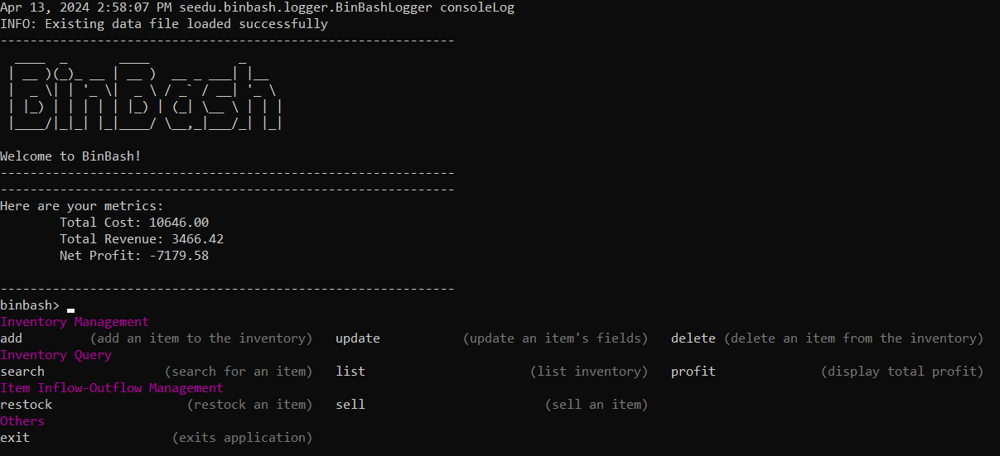
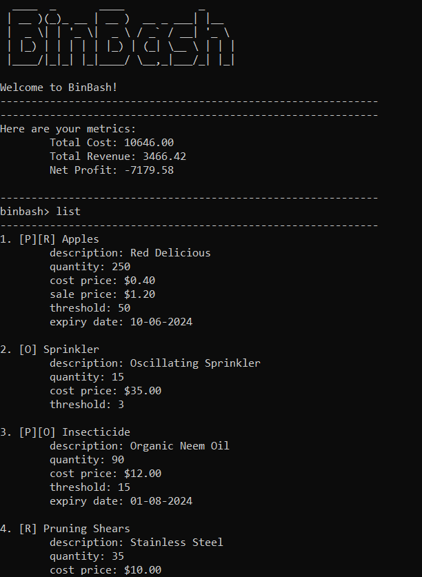
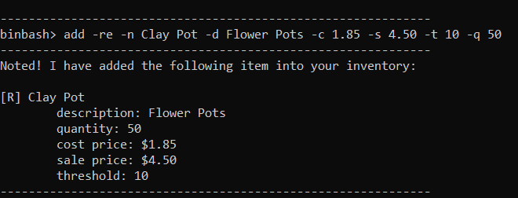
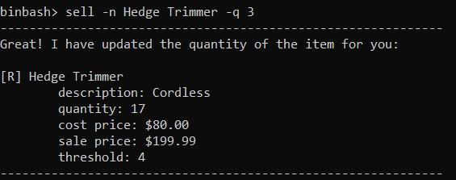
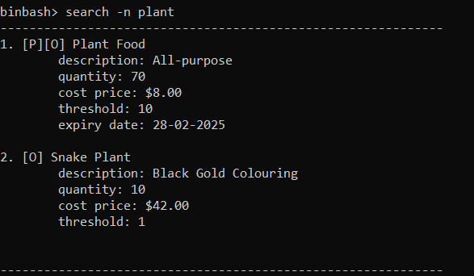

# BinBash

## Welcome!
BinBash is a **desktop application** designed to streamline inventory management for small businesses. Featuring a
user-friendly **Command Line Interface (CLI)**, this lightweight tool efficiently handles all essential inventory tasks
for your daily operations.

## Features
- **Stock Management**: Keep track of what's in stock, with the ability to add, update, sell, restock and delete easily.
- **Inventory viewing**: View your inventory with list and search features to find essential information about your stock.
- **Profit tracking**: Monitor your cost, revenue and profit with just one simple command.
- **Alerts and Notifications**: Receive alerts for low stock levels to ensure you never run out of essential products.

Here's a sneak peek of what you can do!

## Getting Started
Interested to know more on how you can utilise this application for your business? Head down [here](UserGuide.md)
to learn more on how you can set up BinBash on your local desktop and start your inventory management journey.

## Useful links:
* [User Guide](UserGuide.md)
* [Developer Guide](DeveloperGuide.md)
* [About Us](AboutUs.md)

## Acknowledgements
**Libraries used:**
- [Apache Commons CLI](https://commons.apache.org/proper/commons-cli/)
- [Jline](https://github.com/jline/jline3)
