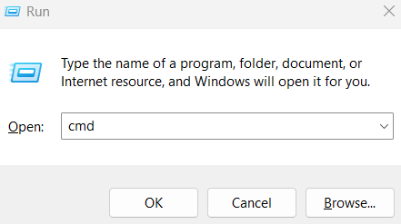
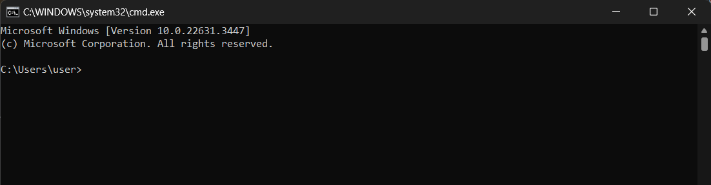
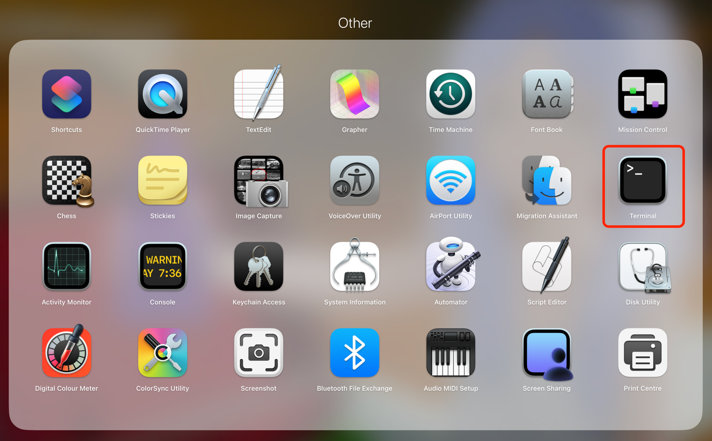
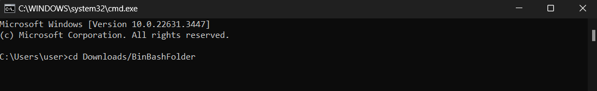
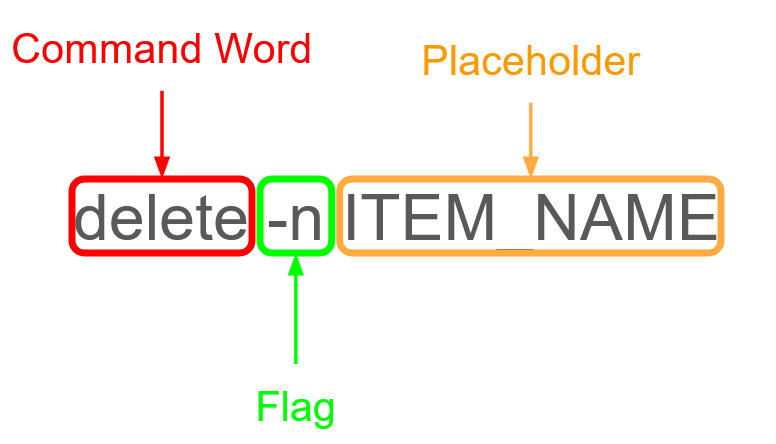

# BinBash User Guide

## Introduction

BinBash is a CLI-based **Inventory Management System** that is targeted at small retail business owners. 
BinBash aims to make the inventory management process streamlined, error-free and highly efficient, through its extensive suite of inventory management features.
BinBash also enables users to gain valuable insights on their inventory, through comprehensive profit reporting features which facilitate efficient sales and trends analysis.

This document aims to provide a comprehensive and in-depth guide on how to install, configure and use BinBash. For those who just want to get started right away, head to [Getting Started](#getting-started).

<!-- Commented out for now.

### What's New in BinBash 1.0

Our long awaited first release adds everything you would expect of an inventory management system, including:
* Adding of items
* Removing of items
* Searching for items
* Listing your entire inventory
* and more (head to [Features](#features) to find out!)
-->

---
<br>

## Table of Contents
1. [Introduction](#introduction)
2. [Table of Contents](#table-of-contents)
3. [BinBash Overview](#binbash-overview)
4. [How to Use this Guide](#how-to-use-this-guide)
5. [Getting Started](#getting-started)
6. [Key Definitions](#key-definitions)
    - [Item](#item)
    - [Flags](#flags)
    - [Placeholders](#placeholders)
    - [Command Format](#command-format)
7. [Features](#features)
    - [Command auto-suggestions](#command-auto-suggestions)
    - [Adding an item: `add`](#adding-an-item-add)
    - [Searching for an item: `search`](#searching-for-an-item-search)
    - [Listing current inventory: `list`](#listing-current-inventory-list)
    - [Selling an item: `sell`](#selling-an-item-sell)
    - [Restocking an item: `restock`](#restocking-an-item-restock)
    - [Updating an item: `update`](#updating-an-item-update)
    - [Deleting an item: `delete`](#deleting-an-item-delete)
    - [Calculating the total profit: `profit`](#calculating-the-total-profit-profit)
    - [Exiting the application: `bye`](#exiting-the-application-bye-exit-quit)
    - [Saving and Loading data](#saving-and-loading-data)
8. [Command Summary](#command-summary)
9. [FAQ](#faq)
10. [Glossary](#glossary)

---
<br>

## BinBash Overview

Welcome to BinBash, an **Inventory Management System** designed to streamline your stock control processes. 
BinBash offers a simple and lightweight solution that makes managing your items fast and efficient, 
thus allowing you more time to focus on your other business needs.
It's built to handle the complexities of inventory tracking so that you don't have to. 

Through BinBash, you can **add**, as well as **track** a variety of items that are present in your inventory. 
If necessary, you can also **delete** these items if they are no longer present.
BinBash also **alerts** you when the quantities of items are running low in your inventory, and allows you to **restock** these items when required.
Furthermore, if items are **sold**, BinBash tracks the sale of these items and generates a **profit analysis**, 
thus providing you with valuable insight on the sales velocity of items in your inventory!

This guide will walk you through each feature, providing clear instructions and examples to ensure that you 
can make the most out of BinBash. Let's get your inventory organized efficiently and effectively!

---
<br>

## How to Use this Guide

Throughout the course of this guide we will describe the various inventory management capabilities BinBash is capable of, and how you might perform them using keyboard typed commands.
The format and expected outputs of these commands will be enumerated in turn. Don't worry if you can't get the hang of them immediately! We'll provide some concrete examples to better illustrate their use cases.

<div id="warningCallout" style="padding: 1em; border: 0 solid #feb144;border-left-width: 4px;border-radius: 6px; margin-top: 1rem; margin-bottom: 1rem; padding: 1em; border-radius: 4px; color: #293132; background-color: #fff8e6;">
❗ This is a warning box that may appear in the guide. Any interactions with the application that can result in issues or errors will be detailed in sections like this one here.
</div>

<div id="infoCallout" style="padding: 1em; border: 0 solid #9ec1cf;border-left-width: 4px;border-radius: 6px; margin-top: 1rem; margin-bottom: 1rem; padding: 1em; border-radius: 4px; color: #293132; background-color: #eef9fc;">
ℹ️ This is an info box that may appear in the guide. Any additional information about a feature will be detailed in sections like this one here.
</div>

<div id="tipCallout" style="padding: 1em; border: 0 solid #9ee09e;border-left-width: 4px;border-radius: 6px; margin-top: 1rem; margin-bottom: 1rem; padding: 1em; border-radius: 4px; color: #293132; background-color: #e6f5e6;">
💡 This is a tip box that may appear in the guide. Things that might be useful for you can be found in sections like this one here.
</div>

If you are new to BinBash (or new to command line-based applications in general), we highly recommend that you read through the rest of this guide sequentially, following the order of sections in this guide.
In particular, we suggest that you take note of the [command format](#notes-on-the-command-format) used by BinBash, as it would provide you with a better understanding of how BinBash processes your commands.

If you consider yourself a power user, feel free to jump to the [Command Summary](#command-summary) section. 
However, if you ever need more clarification on the features provided by a specific command, do head over to the [Features](#features) section, as detailed explanations of each command will be provided there.

[Back to table of contents](#table-of-contents)

---
<br>

## Getting Started

1. Ensure that you have Java `11` or above installed on your computer. Refer to our [FAQ](#faq) for more details.
2. Head over to our [GitHub Page](https://github.com/AY2324S2-CS2113T-T09-2/tp/releases) and download the latest version of `binbash.jar`.
3. Move the downloaded `binbash.jar` file to an empty folder of your choice. This folder will now serve as the home folder for BinBash.
4. Open the terminal/command prompt for your system.
   1. Windows
      * If you're on Windows, press `Windows Key + R` and type in `cmd`. Click `Ok` to launch the command prompt.<br>
      
      * You should see a window appear that is similar to the one shown below.<br>
      
   2. Mac
      * If you're on Mac, click on `Launchpad` > `Other` > `Terminal`.<br>
      <br>
      <br>
      Alternatively, click on the Spotlight icon in your menu bar, and type in `Terminal`.
   3. Linux
      * If you're on Linux, open the terminal in your Linux distribution.
5. Navigate to the folder containing `binbash.jar` using the terminal/command prompt.
   * To do this, you can key in `cd` into the command prompt followed by the file location of `binbash.jar`.
   * Here is an example on Windows:<br>
   
6. Type `java -jar binbash.jar` into the command prompt, and press enter. If the application has started successfully, you should see the following output:<br>
    ```text
    -------------------------------------------------------------
     ____  _       ____            _
    | __ )(_)_ __ | __ )  __ _ ___| |__
    |  _ \| | '_ \|  _ \ / _` / __| '_ \
    | |_) | | | | | |_) | (_| \__ \ | | |
    |____/|_|_| |_|____/ \__,_|___/_| |_|
    
    Welcome to BinBash!
    -------------------------------------------------------------
    -------------------------------------------------------------
    Here are your metrics:
    Total Cost: 0.00
    Total Revenue: 0.00
    Net Profit: 0.00
    
    -------------------------------------------------------------
    ```

Awesome! You've now successfully started the BinBash application!

Now, you can head over to the [Features](#features) section to learn how to use the application.

#### Possible Issues During Startup

Have problems loading up BinBash? Fret not, here's how to troubleshoot some of them:

1. **File is Corrupted Error**:<br>
   If you encounter an error that says the file is corrupted, you should first take a look at your `items.txt` file. It's possible that the content of the file has become invalid. Here's what you can do:
    - **Delete and Recreate**: If you're unsure about the formatting, simply delete the `items.txt` file. BinBash will create a new one when you restart the application.
    - **Rectify the Content**: If you have important data you can't lose, open the `items.txt` file and fix any formatting issues. Make sure each task follows the correct structure BinBash expects. Refer to the [FAQ](#faq) for more details on the expected save file format.

2. **Issues with Data Directory or File**:<br>
   If you encounter an error about not being able to create or read/write from the data directory or file, this usually means there's a permissions issue on your system. Here's how to handle it:
    - **Check Permissions**: Ensure that BinBash has the right permissions to access the folders it needs. Right-click on the directory and check its properties to make sure reading and writing are allowed.

3. **Unable to Access System Terminal**:<br>
   Ensure that you're using a recent version of your Operating System's Terminal application. For Windows, consider using Powershell or Terminal instead of Command Prompt.

[Back to table of contents](#table-of-contents)

---
<br>

## Key Definitions

### Item

An `Item` in BinBash represents an entity within your inventory system, which could be anything from products for sale 
to supplies for operations. Items are characterized by their attributes, which provide detailed information for 
inventory management.

BinBash categorizes items into **four** types, each with its attributes that facilitate proper inventory tracking. A 
brief description of the four item types is as follows:

1. `Retail Item`: These are items that are intended for sale to customers. Retail items typically include products that are stocked and sold for profit.
    - **Example**: A pair of sneakers up for sale.

2. `Operational Item`: These items are used by the store for its daily operations but are not sold to customers.
    - **Example**: An operational item could be a printer cartridge for a company printer.

3. `Perishable Retail Item`: These are retail items that have an expiry date and need to be sold before they spoil.
   This category is crucial for businesses dealing with food products or other perishable goods.
    - **Example**: A perishable retail item could be a carton of milk to be sold, which has an expiry date.

4. `Perishable Operational Item`: Similar to perishable retail items, these are operational items that have a limited shelf life.
    - **Example**: A bottle of disinfectant used to sanitize the office, with an expiry date.

Each of the four item types in BinBash may have various attributes, which provide important details for managing your 
inventory. Here are some attributes that may apply to the different item types:

- **Item name**: The unique identifier for the item.
- **Item description**: A narrative describing the item.
- **Item quantity**: How many units of the item are currently in stock.
- **Sale price**: The price at which the item will be sold to customers.
- **Cost price**: The price at which the item was purchased by the store.
- **Threshold**: A number indicating the minimum stock level before a restock is needed.
- **Expiry date**: The date when a perishable item should be sold or used before it spoils.

For all item types, BinBash uses the item name as a primary identifier. It is important to use distinct names for 
different items.

Restrictions for the different attributes can be found in the [Placeholders](#placeholders) section, or within the 
specific feature in the [Features](#features) section.

### Flags

Flags are delimiters in BinBash that enable the system to distinguish different parameters without ambiguity. 
You would enter the corresponding [Placeholder](#placeholders) immediately after each flag.

<div id="tipCallout" style="padding: 1em; border: 0 solid #9ee09e;border-left-width: 4px;border-radius: 6px; margin-top: 1rem; margin-bottom: 1rem; padding: 1em; border-radius: 4px; color: #293132; background-color: #e6f5e6;">
💡 <strong>Tip:</strong><br>
You may find the following image taken from the subsequent <a href="#command-format">Command Format</a> section helpful:<br>
<br>
<em>Illustration of how flags and placeholders are used in BinBash's command structure.</em><br><br>
Please refer to the subsequent <a href="#command-format">Command Format</a> section to see how Flags and Placeholders are used together.
</div>

| Flag  | Corresponding Placeholder               |
|-------|-----------------------------------------|
| `-n`  | ITEM_NAME                               |
| `-i`  | ITEM_INDEX                              |
| `-d`  | ITEM_DESCRIPTION                        |
| `-q`  | QUANTITY                                |
| `-e`  | EXPIRY_DATE **(Perishable items only)** |
| `-c`  | COST_PRICE                              |
| `-s`  | SALE_PRICE **(Retail items only)**      |
| `-t`  | THRESHOLD                               |
| `-re` | Not Applicable                          |
| `-op` | Not Applicable                          |
| `-p`  | Not Applicable                          |

<div id="infoCallout" style="padding: 1em; border: 0 solid #9ec1cf;border-left-width: 4px;border-radius: 6px; margin-top: 1rem; margin-bottom: 1rem; padding: 1em; border-radius: 4px; color: #293132; background-color: #eef9fc;">
ℹ️ <strong>Note:</strong>
<li>Only one item type flag can be specified for each item. This means that you can only use either <code>-re</code> or <code>-op</code> but not both at the same time. </li> 
<li>The <code>-e</code> flag should be provided if the item that you are adding is a Perishable item. That is to say, it will expire by the provided expiry date.</li>
<li>The <code>-s</code> flag should be provided if the item that you are adding is a Retail item. This means that this item is meant to be sold.</li>
<li>The flags can be placed in any order. There is no specific order that you have to abide by.</li>
<li>Words in <code>UPPER_CASE</code> are the arguments that are meant to be supplied by you.<br>For example, in <code>-n ITEM_NAME</code>, <code>ITEM_NAME</code> would represent the name of the item you are adding (e.g., <code>add -n apple</code>).</li>
<li>For some commands, if flags and arguments are wrapped in square brackets, they are optional.<br>For example, <code>add [-q ITEM_QUANTITY]</code> signify that the <code>-q</code> flag, as well as its argument, are optional for the command.</li>
</div>

<div id="infoCallout" style="padding: 1em; border: 0 solid #9ec1cf;border-left-width: 4px;border-radius: 6px; margin-top: 1rem; margin-bottom: 1rem; padding: 1em; border-radius: 4px; color: #293132; background-color: #eef9fc;">
ℹ️ <strong>Note:</strong>
The flags <code>-re</code>, <code>-op</code> and <code>-p</code> do not have any corresponding placeholders. They are marked as "Not Applicable" in 
the table above.
</div>

### Placeholders

In this User Guide, placeholders refer to the UPPER_CASE words that are replaced by user-supplied values. These 
placeholders are used after a [Flag](#flags) in the command.

Refer to the subsequent [Command Format](#command-format) section to see how Flags and Placeholders are used together in
each command in BinBash.

<div id="infoCallout" style="padding: 1em; border: 0 solid #9ec1cf;border-left-width: 4px;border-radius: 6px; margin-top: 1rem; margin-bottom: 1rem; padding: 1em; border-radius: 4px; color: #293132; background-color: #eef9fc;">
ℹ️ <strong>Note:</strong>
The <code>COMMAND_WORD</code> placeholder does not have a corresponding flag and is marked as "Not Applicable" in the table below.
</div>

<!-- Replaced with HTML table
| Placeholder        | Corresponding Flag | Description                                                                                                                                                                                                                                                                                                                                                                                                                                                       |
|--------------------|--------------------|-------------------------------------------------------------------------------------------------------------------------------------------------------------------------------------------------------------------------------------------------------------------------------------------------------------------------------------------------------------------------------------------------------------------------------------------------------------------|
| `ITEM_NAME`        | `-n`               | ITEM_NAME is the name used to identify an item.<br>**Info:**<ul><li>May contain alphanumeric and special characters but cannot be blank.</li><li>It's unique and case-sensitive.</li><li>Leading and trailing spaces are trimmed.</li></ul>**Valid Examples:** `sneakers`, `printer cartridge`<br>**Invalid Examples:** (Any non-unique or blank entry)                                                                                                           |
| `ITEM_DESCRIPTION` | `-d`               | ITEM_DESCRIPTION provides details about the item.<br>**Info:**<ul><li>Can include most characters and symbols.</li><li>Should give a clear idea of the item's features or use.</li></ul>**Valid Examples:** `Black and white running sneakers`, `High-yield color cartridge`<br>**Invalid Examples:** (Any unclear or overly lengthy description)                                                                                                                 |
| `ITEM_QUANTITY`    | `-q`               | ITEM_QUANTITY is how much of the item is in stock.<br>**Info:**<ul><li>Must be a non-negative whole number.</li></ul>**Valid Examples:** `350`, `20`<br>**Invalid Examples:** `-10`, `100.5`                                                                                                                                                                                                                                                                      |
| `EXPIRY_DATE`      | `-e`               | EXPIRY_DATE is when a perishable item will spoil.<br>**Info:**<ul><li>Must be in `DD-MM-YYYY` format.</li><li>Relevant for perishable items only.</li></ul>**Valid Examples:** `12-12-2024`, `02-11-2024`<br>**Invalid Examples:** `2024-12-12`, `12/12/2024`                                                                                                                                                                                                     |
| `COST_PRICE`       | `-c`               | COST_PRICE is the buying price of the item. It is the price that the store owner bought the item for. <br>**Info:**<ul><li>Is a non-negative number with up to 2 decimal places.</li></ul>**Valid Examples:** `34.32`, `1.30`<br>**Invalid Examples:** `-34.32`, `$34.32`                                                                                                                                                                                         |
| `SALE_PRICE`       | `-s`               | SALE_PRICE is the selling price for retail items.<br>**Info:**<ul><li>Is a non-negative number. </li><li>Used only for retail items.</li><li>A `$` is automatically prefixed.</li></ul>**Valid Examples:** `102.00`, `10.00`<br>**Invalid Examples:** `-102.00`, `$10.00`                                                                                                                                                                                         |
| `INDEX`            | `-i`               | The INDEX is the number to the left of the item name when the `list` command is called.<br>**Info:**<ul><li>INDEX must be a whole number larger than 0.</li><li>It is dependent on the current view of the item list.</li><li>Do not use thousands separators like `,` in INDEX.</li></ul>**Valid Examples:** `1`, `124`<br>**Invalid Examples:** `-1`, `1.5`, `1,132`, `1 132`                                                                                   |
| `THRESHOLD`        | `-t`               | THRESHOLD is the minimum stock before an alert is issued.<br>**Info:**<ul><li>Must be a non-negative whole number.</li><li>If not specified, `1` is used by default.</li></ul>**Valid Examples:** `50`, `10`<br>**Invalid Examples:** `-50`, `10.5`                                                                                                                                                                                                               |
| `COMMAND_WORD`     | (Not Applicable)   | The COMMAND_WORD is a specific keyword that triggers a command in BinBash.<br>**Info:**<ul><li>COMMAND_WORD is strictly one of the specified keywords below.</li></ul>**Valid Examples:**<ul><li>`add`</li><li>`bye`</li><li>`exit`</li><li>`quit`</li><li>`delete`</li><li>`list`</li><li>`profit`</li><li>`restock`</li><li>`search`</li><li>`sell`</li><li>`update`</li></ul>**Invalid Examples:**<ul><li>Any text not listed in the valid examples.</li></ul> |
-->

<table>
<thead>
<tr>
<th>Placeholder</th>
<th>Corresponding Flag</th>
<th>Description</th>
</tr>
</thead>
<tbody>
<tr>
<td><code>ITEM_NAME</code></td>
<td><code>-n</code></td>
<td>ITEM_NAME is the name used to identify an item.<br><strong>Info:</strong><ul><li>May contain alphanumeric and special characters but cannot be blank.</li><li>It&#39;s unique and case-sensitive.</li><li>Leading and trailing spaces are trimmed.</li></ul><strong>Valid Examples:</strong> <code>sneakers</code>, <code>printer cartridge</code><br><strong>Invalid Examples:</strong> (Any non-unique or blank entry)</td>
</tr>
<tr>
<td><code>ITEM_DESCRIPTION</code></td>
<td><code>-d</code></td>
<td>ITEM_DESCRIPTION provides details about the item.<br><strong>Info:</strong><ul><li>Can include most characters and symbols.</li><li>Should give a clear idea of the item&#39;s features or use.</li></ul><strong>Valid Examples:</strong> <code>Black and white running sneakers</code>, <code>High-yield color cartridge</code><br><strong>Invalid Examples:</strong> (Any unclear or overly lengthy description)</td>
</tr>
<tr>
<td><code>ITEM_QUANTITY</code></td>
<td><code>-q</code></td>
<td>ITEM_QUANTITY is how much of the item is in stock.<br><strong>Info:</strong><ul><li>Must be a non-negative whole number.</li></ul><strong>Valid Examples:</strong> <code>350</code>, <code>20</code><br><strong>Invalid Examples:</strong> <code>-10</code>, <code>100.5</code></td>
</tr>
<tr>
<td><code>EXPIRY_DATE</code></td>
<td><code>-e</code></td>
<td>EXPIRY_DATE is when a perishable item will spoil.<br><strong>Info:</strong><ul><li>Must be in <code>DD-MM-YYYY</code> format.</li><li>Relevant for perishable items only.</li></ul><strong>Valid Examples:</strong> <code>12-12-2024</code>, <code>02-11-2024</code><br><strong>Invalid Examples:</strong> <code>2024-12-12</code>, <code>12/12/2024</code></td>
</tr>
<tr>
<td><code>COST_PRICE</code></td>
<td><code>-c</code></td>
<td>COST_PRICE is the buying price of the item. It is the price that the store owner bought the item for. <br><strong>Info:</strong><ul><li>Is a non-negative number with up to 2 decimal places.</li></ul><strong>Valid Examples:</strong> <code>34.32</code>, <code>1.30</code><br><strong>Invalid Examples:</strong> <code>-34.32</code>, <code>$34.32</code></td>
</tr>
<tr>
<td><code>SALE_PRICE</code></td>
<td><code>-s</code></td>
<td>SALE_PRICE is the selling price for retail items.<br><strong>Info:</strong><ul><li>Is a non-negative number. </li><li>Used only for retail items.</li><li>A <code>$</code> is automatically prefixed.</li></ul><strong>Valid Examples:</strong> <code>102.00</code>, <code>10.00</code><br><strong>Invalid Examples:</strong> <code>-102.00</code>, <code>$10.00</code></td>
</tr>
<tr>
<td><code>INDEX</code></td>
<td><code>-i</code></td>
<td>The INDEX is the number to the left of the item name when the <code>list</code> command is called.<br><strong>Info:</strong><ul><li>INDEX must be a whole number larger than 0.</li><li>It is dependent on the current view of the item list.</li><li>Do not use thousands separators like <code>,</code> in INDEX.</li></ul><strong>Valid Examples:</strong> <code>1</code>, <code>124</code><br><strong>Invalid Examples:</strong> <code>-1</code>, <code>1.5</code>, <code>1,132</code>, <code>1 132</code></td>
</tr>
<tr>
<td><code>THRESHOLD</code></td>
<td><code>-t</code></td>
<td>THRESHOLD is the minimum stock before an alert is issued.<br><strong>Info:</strong><ul><li>Must be a non-negative whole number.</li><li>If not specified, <code>1</code> is used by default.</li></ul><strong>Valid Examples:</strong> <code>50</code>, <code>10</code><br><strong>Invalid Examples:</strong> <code>-50</code>, <code>10.5</code></td>
</tr>
<tr>
<td><code>COMMAND_WORD</code></td>
<td>(Not Applicable)</td>
<td>The COMMAND_WORD is a specific keyword that triggers a command in BinBash.<br><strong>Info:</strong><ul><li>COMMAND_WORD is strictly one of the specified keywords below.</li></ul><strong>Valid Examples:</strong><ul><li><code>add</code></li><li><code>bye</code></li><li><code>exit</code></li><li><code>quit</code></li><li><code>delete</code></li><li><code>list</code></li><li><code>profit</code></li><li><code>restock</code></li><li><code>search</code></li><li><code>sell</code></li><li><code>update</code></li></ul><strong>Invalid Examples:</strong><ul><li>Any text not listed in the valid examples.</li></ul></td>
</tr>
</tbody>
</table>

### Command Format

You will encounter BinBash commands throughout this User Guide. Before you delve into the different commands in the 
Features section, let's first learn what a command consists of.

Here is an example: <br>


A command consists of:

1. **Command Word**: Tells BinBash what action you wish to execute.
2. **Flags**: Distinguishes between inputs. A flag is usually followed by a placeholder.
3. **Placeholders**: Represents data that you wish to input. Replace this with valid data. Using the example in the 
image above, `ITEM_NAME` in `-n ITEM_NAME` can be replaced with `-n Potato`.

Now that you understand the command structure of BinBash, you're ready to learn about the different commands available, 
and how they can be of use to your business!

[Back to table of contents](#table-of-contents)

---
<br>

## Features

This section shares with you on the different features available in BinBash. Before continuing, ensure you have read the
section on [Flags](#flags) and [Placeholders](#placeholders). 

Each feature in BinBash can be implemented through the use of a command, and for each of the commands, you may expect 
the following:
- A description of the command
- The format of the command
- The expected behavior of the command
- A few valid examples of the command, together with their explanations.
- Important points to note

However, if you've read the previous sections and are starting to feel confused about the use of flags and placeholders in 
achieving your inventory needs, don't worry! Continue reading to know more about BinBash's Command auto-suggestions 
feature that can help you out. It's like having a little helper right at your fingertips!

### Command auto-suggestions

BinBash's command suggestion feature can be activated by pressing the `tab` key which either:
1. Suggests a lists of all valid options on first press; then cycles through this list on subsequent presses; or
2. Autocompletes the command if only 1 valid option is found
Each suggestion is accompanied by a brief description.

To use this feature on command flags, type `-` before pressing `tab`.
As before, each flag is accompanied by an explanation.

To exit command suggestion mode simply press any other key.

<div id="tipCallout" style="padding: 1em; border: 0 solid #9ee09e;border-left-width: 4px;border-radius: 6px; margin-top: 1rem; margin-bottom: 1rem; padding: 1em; border-radius: 4px; color: #293132; background-color: #e6f5e6;">
💡 <strong>Tip:</strong> This feature is particularly handy when first learning to use BinBash. Starting from a blank input, press tab to see every command.<br>
Likewise within each command, type <code>-</code> followed by <code>TAB</code> to give a quick overview of all possible options.
</div>

[Back to table of contents](#table-of-contents)

---
<br>

### Adding an item: `add`

> This allows you to add a new item to start keeping track of in your inventory.

#### Adding a Retail item

Format: `add -re -n ITEM_NAME -d ITEM_DESCRIPTION -s SALE_PRICE -c COST_PRICE [-q ITEM_QUANTITY] [-t THRESHOLD]`

* `-re` specifies that this is a Retail item.
* `ITEM_NAME`, `ITEM_DESCRIPTION`, `SALE_PRICE` and `COST_PRICE` must be specified.

<div id="infoCallout" style="padding: 1em; border: 0 solid #9ec1cf;border-left-width: 4px;border-radius: 6px; margin-top: 1rem; margin-bottom: 1rem; padding: 1em; border-radius: 4px; color: #293132; background-color: #eef9fc;">
ℹ️ <strong>Note:</strong> The <code>ITEM_NAME</code> field must be unique for each item in your inventory. If you wish to add different batches of the same item with different expiry dates, consider naming them with a suffix, e.g., <code>Milo_1</code>, <code>Milo_2</code>.
</div>

* All other fields are optional.
* If `ITEM_QUANTITY` is not specified, a default value of `0` will be assigned to it.
This allows you to create a placeholder for an item in your inventory you've yet to receive any stock of.

<div id="tipCallout" style="padding: 1em; border: 0 solid #9ee09e;border-left-width: 4px;border-radius: 6px; margin-top: 1rem; margin-bottom: 1rem; padding: 1em; border-radius: 4px; color: #293132; background-color: #e6f5e6;">
💡 <strong>Tip:</strong> Once you've received stock of the item, you can call the <a href="#restocking-an-item-restock"><code>restock</code></a> command to increase the stocked quantity of the item.
</div>

* If `THRESHOLD` is not specified, a default value of `1` will be assigned to it.
* There is no need to include the currency. A `$` sign will be appended to the prices.
* Retail items do not have an `EXPIRY_DATE` field, hence the flag `-e` is not used.

Examples:

- `add -re -n lego -d toys -q 350 -s 102.00 -c 34.32 -t 50`<br>
   ```text
   -------------------------------------------------------------
   Noted! I have added the following item into your inventory:
    
   [R] lego
       description: toys
       quantity: 350
       cost price: $34.32
       sale price: $102.00
       threshold: 50
   -------------------------------------------------------------
   ```
- `add -re -n hammer -d tools -q 20 -s 9.00 -c 4.39 -t 10`<br>
   ```text
   -------------------------------------------------------------
   Noted! I have added the following item into your inventory:
    
   [R] hammer
       description: tools
       quantity: 20
       cost price: $4.39
       sale price: $9.00
       threshold: 10
   -------------------------------------------------------------
   ```

#### Adding a Perishable Retail item

Format: `add -re -n ITEM_NAME -d ITEM_DESCRIPTION -e EXPIRY_DATE -s SALE_PRICE -c COST_PRICE [-q ITEM_QUANTITY] [-t THRESHOLD]`

* The command to add a Perishable Retail item is similar to adding a Retail item.
* An additional flag , `-e`, is used here to include the `EXPIRY_DATE`, hence signifying a Perishable Retail item.

<div id="infoCallout" style="padding: 1em; border: 0 solid #9ec1cf;border-left-width: 4px;border-radius: 6px; margin-top: 1rem; margin-bottom: 1rem; padding: 1em; border-radius: 4px; color: #293132; background-color: #eef9fc;">
ℹ️ <strong>Note:</strong> Ensure that the provided date is in <code>DD-MM-YYYY</code> format. For example, <strong>20 January 2024</strong> is represented as <code>20-01-2024</code>.
</div>

Examples:

- `add -re -n apple -d fruit -q 50 -e 12-12-2024 -s 1.00 -c 0.39 -t 10`<br>
   ```text
   -------------------------------------------------------------
   Noted! I have added the following item into your inventory:
    
   [P][R] apple
       description: fruit
       quantity: 50
       cost price: $0.39
       sale price: $1.00
       threshold: 10
       expiry date: 12-12-2024
   -------------------------------------------------------------
   ```
- `add -re -n tuna fish -d seafood -q 5 -e 02-11-2024 -s 10 -c 4.50`<br>
   ```text
   -------------------------------------------------------------
   Noted! I have added the following item into your inventory:
    
   [P][R] tuna fish
       description: seafood
       quantity: 5
       cost price: $4.50
       sale price: $10.00 
       threshold: 1
       expiry date: 02-11-2024
   -------------------------------------------------------------
   ```

#### Adding an Operational item

Format: `add -op -n ITEM_NAME -d ITEM_DESCRIPTION -c COST_PRICE [-q ITEM_QUANTITY] [-t THRESHOLD]`

* `-op` specifies that this is an Operational Item.
* `ITEM_NAME`, `ITEM_DESCRIPTION` and `COST_PRICE` must be specified.

<div id="tipCallout" style="padding: 1em; border: 0 solid #9ee09e;border-left-width: 4px;border-radius: 6px; margin-top: 1rem; margin-bottom: 1rem; padding: 1em; border-radius: 4px; color: #293132; background-color: #e6f5e6;">
💡 <strong>Tip:</strong> Once you've received stock of the item, you can call the <a href="#restocking-an-item-restock"><code>restock</code></a> command to increase the stocked quantity of the item.
</div>

* All other fields are optional.
* If `ITEM_QUANTITY` is not specified, a default value of `0` will be assigned to it.
This allows you to create a placeholder for an item in your inventory you've yet to receive any stock of.

<div id="tipCallout" style="padding: 1em; border: 0 solid #9ee09e;border-left-width: 4px;border-radius: 6px; margin-top: 1rem; margin-bottom: 1rem; padding: 1em; border-radius: 4px; color: #293132; background-color: #e6f5e6;">
💡 <strong>Tip:</strong> Once you've received stock of the item, you can call the <a href="#restocking-an-item-restock"><code>restock</code></a> command to increase the stocked quantity of the item.
</div>

* If `THRESHOLD` is not specified, a default value of `1` will be assigned to it.
* There is no need to include the currency. A `$` sign will be appended to the prices.
* `-s` and `-e` are not used as there are no `SALE_PRICE` and `EXPIRY_DATE` fields for an Operational Item.

Examples:

- `add -op -n light bulbs -d lighting -q 5 -c 2.30 -t 3`<br>
   ```text
   -------------------------------------------------------------
   Noted! I have added the following item into your inventory:
    
   [O] light bulbs
       description: lighting
       quantity: 5
       cost price: $2.30
       threshold: 3
   -------------------------------------------------------------
   ```

#### Adding a Perishable Operational item

Format: `add -op -n ITEM_NAME -d ITEM_DESCRIPTION -e EXPIRY_DATE -c COST_PRICE [-q ITEM_QUANTITY] [-t THRESHOLD]`

* The command to add a Perishable Operational item is similar to adding an Operational item.
* An additional flag , `-e`, is used here to include the `EXPIRY_DATE`, hence signifying a Perishable Operational item.

<div id="infoCallout" style="padding: 1em; border: 0 solid #9ec1cf;border-left-width: 4px;border-radius: 6px; margin-top: 1rem; margin-bottom: 1rem; padding: 1em; border-radius: 4px; color: #293132; background-color: #eef9fc;">
ℹ️ <strong>Note:</strong> Ensure that the provided date is in <code>DD-MM-YYYY</code> format. For example, <strong>20 January 2024</strong> is represented as <code>20-01-2024</code>.
</div>

* `-s` is not used as there is no `SALE_PRICE` for a Perishable Operational Item.

Examples:

- `add -op -n milk -d to make coffee -q 2 -e 03-10-2024 -c 1.30`<br>
   ```text
   -------------------------------------------------------------
   Noted! I have added the following item into your inventory:
    
   [P][O] milk
       description: to make coffee
       quantity: 2
       cost price: $1.30
       threshold: 1
       expiry date: 03-10-2024
   -------------------------------------------------------------
   ```

[Back to table of contents](#table-of-contents)

---
<br>

### Searching for an item: `search`

> This allows you to search for items in your inventory, filtering results through a number of item-specific fields.

Format: `search -n NAME_QUERY -d DESCRIPTION_QUERY -q QUANTITY_RANGE -c COST_PRICE_RANGE -s SALE_PRICE_RANGE -e EXPIRY_DATE_RANGE -l NUMBER_OF_RESULTS`

- At least one of `-n`, `-d`, `-q`, `-c`, `-s`, or `-e` must be set.
- `NAME_QUERY` and `DESCRIPTION_QUERY` perform a case-insensitive search on the name and description fields of inventory items respectively.
- `RANGE` searches take the form `{min_value}..{max_value}` and are inclusive of the minimum or maximum values specified.
  - At least one of `min_value` or `max_value` is required.
  - Omitting `min_value` searches for everything up to and including the `max_value`.
  - Omitting `max_value` searches for everything with at least `min_value`.

<div id="tipCallout" style="padding: 1em; border: 0 solid #9ee09e;border-left-width: 4px;border-radius: 6px; margin-top: 1rem; margin-bottom: 1rem; padding: 1em; border-radius: 4px; color: #293132; background-color: #e6f5e6;">
💡 <strong>Tip:</strong><br> For example, to search for items with a quantity up to and including 20, we should format our query as:<br>
<code>-q ..20</code>.<br>
To search for items that cost at least $15, we should format our query as:<br>
<code>-c 15..</code>.
</div>

- `EXPIRY_DATE_RANGE` is similar to the above range arguments: except dates need to be specified in the format `dd-MM-YYYY`.

<div id="tipCallout" style="padding: 1em; border: 0 solid #9ee09e;border-left-width: 4px;border-radius: 6px; margin-top: 1rem; margin-bottom: 1rem; padding: 1em; border-radius: 4px; color: #293132; background-color: #e6f5e6;">
💡<strong>Tip:</strong><br> For example, to search for items with an expiry date between 20 January 2024 and 30 January 2024, we should format our query as:<br>
<code>-e 20-01-2024..30-01-2024</code>.
</div>

- Shows the first `NUMBER_OF_RESULTS` results if set, else all matching results are shown.

**Examples:**

- `search -n snake plant`
  Will return all items with names containing **snake plant**, such as "snake plant" and "snake plant seeds".
- `search -l 6 -c ..5`
  Will return the first 6 items that cost up to and including $5.00.
- `search -s 20..30`
  Will return all items with sale prices between $20 and $30 (inclusive).
- `search -l 1 -e 11-11-2023.. -d seeds`
  Will return the first item expiring on or after 11 November 2023 and that contain the word "seeds" in its description.
- `search -q 50.. -e 17-09-2023..23-11-2023`
  Will return all items with current quantity at or above 50 and that expire between 17 September 2023 and 23 November 2023 (inclusive).

[Back to table of contents](#table-of-contents)

---
<br>

### Listing current inventory: `list`

> This allows you to list out all items that you have in your inventory list. 
> You can also use this command to display your inventory list, sorted based on cost price, sale price, profit, or expiry date.

<div id="tipCallout" style="padding: 1em; border: 0 solid #9ee09e;border-left-width: 4px;border-radius: 6px; margin-top: 1rem; margin-bottom: 1rem; padding: 1em; border-radius: 4px; color: #293132; background-color: #e6f5e6;">
💡 <strong>Tip:</strong> Indexes of the items listed, whether in a sorted list or unsorted list, can be used as references for <code>delete</code> and <code>update</code> commands.
</div>

#### List Inventory (Unsorted)

View the inventory in the order items were added:

Format: `list`

#### List Inventory (Sorted)

BinBash also allows you to sort your inventory in ascending order based on different criteria. This means that items 
with the lowest 'values' will be showed first, whilst items with the highest 'values' will be showed last. The different
'values' that BinBash can sort by can be seen below:

| Flag | Description                                |
|------|--------------------------------------------|
| `-c` | Sort by cost price                         |
| `-s` | Sort by sale price                         |
| `-p` | Sort by profit                             |
| `-e` | Sort by expiry date (for perishable items) |

Format: `list -FLAG`

Example: 

Suppose you have the following items in your inventory:
- Item A (Perishable Retail), Cost Price: $5, Sale Price: $15, Expiry Date: 01-05-2023
- Item B (Perishable Retail), Cost Price: $10, Sale Price: $12, Expiry Date: 15-04-2023
- Item C (Perishable Operational), Cost Price: $3, Expiry Date: 10-07-2023
- Item D (Non-perishable Retail), Cost Price: $7, Sale Price: $14

Using `list -c`, BinBash sorts all items by cost price in ascending order:
- Item C, Cost Price: $3
- Item A, Cost Price: $5
- Item D, Cost Price: $7
- Item B, Cost Price: $10

Using `list -e`, BinBash sorts the items in order of which items will expire first. Notice how BinBash will filter out 
non-perishable items (Item D) and sort the remaining items by their expiry date:
- Item B, Expiry Date: 15-04-2023
- Item A, Expiry Date: 01-05-2023
- Item C, Expiry Date: 10-07-2023

Similarly, you can use `list -s` to sort the items by sale price and `list -p` to sort by profit. Once again, 
note that for sorting the items by sale price and by profit, operational items like Item C will not appear in these 
sorted lists as they do not have a sale price.

[Back to table of contents](#table-of-contents)

---
<br>

### Selling an item: `sell`

> This allows you to decrement the quantity of an item after it has been sold.

#### Selling an item using item name

Format: `sell -n ITEM_NAME -q ITEM_QUANTITY`

* Both flags `-n` and `-q` are mandatory.
* The flag `-n` is used, meaning that the `item name` is used as an identifier to identify the item you wish to sell.
* The quantity given to this command represents the amount of item that you want to sell. This amount will be reduced
  from the existing quantity of the item in the inventory list.

Examples: 

- `sell -n oranges -q 20` This will deduct the quantity of "oranges" in your inventory list by 20.
- `sell -n lego bricks -q 219` This will deduct the quantity of "lego bricks" in your inventory list by 219.

#### Selling an item using item index

Format: `sell -i ITEM_INDEX -q ITEM_QUANTITY`

<div id="tipCallout" style="padding: 1em; border: 0 solid #9ee09e;border-left-width: 4px;border-radius: 6px; margin-top: 1rem; margin-bottom: 1rem; padding: 1em; border-radius: 4px; color: #293132; background-color: #e6f5e6;">
💡 <strong>Tip:</strong> To determine the <code>index</code> of an item in your inventory, call the <code>list</code> command first, and note down the number displayed next to your item of interest.
</div>

* Both flags `-i` and `-q` are mandatory.
* The flag `-i` is used, meaning that the `item index` is used as an identifier to identify the item you wish to sell.

Examples:
- `sell -i 1 -q 50` This will decrease the quantity of the item at index 1 in your inventory list by 50.
- `sell -i 3 -q 35` This will decrease the quantity of the item at index 3 in your inventory list by 35.

<div id="infoCallout" style="padding: 1em; border: 0 solid #9ec1cf;border-left-width: 4px;border-radius: 6px; margin-top: 1rem; margin-bottom: 1rem; padding: 1em; border-radius: 4px; color: #293132; background-color: #eef9fc;">
ℹ️ <strong>Note:</strong><br> 
<li>Only one item identifier flag, <code>-n</code> or <code>-i</code>, can be used with the <code>sell</code> command to identify the item that you want to sell.</li>
<li>There must be a minimum of one flag used, excluding the <code>-n</code> or <code>-i</code> flag.</li>
</div>

[Back to table of contents](#table-of-contents)

---
<br>

### Restocking an item: `restock`

> This allows you to increment the quantity of an item after it has been restocked.

#### Restocking an item using item name

Format: `restock -n ITEM_NAME -q ITEM_QUANTITY`

* Both flags `-n` and `-q` are mandatory.
* The flag `-n` is used, meaning that the `item name` is used as an identifier to identify the item you wish to restock.
* The quantity given to this command represents the amount of item that you want to restock. This amount will be added
  to the existing quantity of the item in the inventory list.

Examples:

- `restock -n apples -q 50` This will add the quantity of "apples" in your inventory list by 50. .

#### Restocking an item using item index

Format: `restock -i ITEM_INDEX -q ITEM_QUANTITY`

<div id="tipCallout" style="padding: 1em; border: 0 solid #9ee09e;border-left-width: 4px;border-radius: 6px; margin-top: 1rem; margin-bottom: 1rem; padding: 1em; border-radius: 4px; color: #293132; background-color: #e6f5e6;">
💡 <strong>Tip:</strong> To determine the <code>index</code> of an item in your inventory, call the <code>list</code> command first, and note down the number displayed next to your item of interest.
</div>

* Both flags `-i` and `-q` are mandatory.
* The flag `-i` is used, meaning that the `item index` is used as an identifier to identify the item you wish to update.

Examples:
- `restock -i 2 -q 10` This will add the quantity of the item at index 2 in your inventory list by 10.

<div id="infoCallout" style="padding: 1em; border: 0 solid #9ec1cf;border-left-width: 4px;border-radius: 6px; margin-top: 1rem; margin-bottom: 1rem; padding: 1em; border-radius: 4px; color: #293132; background-color: #eef9fc;">
ℹ️ <strong>Note:</strong><br> 
<li>Only one item identifier flag, <code>-n</code> or <code>-i</code>, can be used with the <code>restock</code> command to identify the item that you want to sell.</li>
<li>There must be a minimum of one flag used, excluding the <code>-n</code> or <code>-i</code> flag.</li>
</div>

[Back to table of contents](#table-of-contents)

---
<br>

### Updating an item: `update`

> This command allows you to modify the details of an existing item in the inventory. You can identify the item that you want to update, by
> specifying the name of the object, or its index number as displayed in the inventory list.

#### Updating an item using item name

Format: `update -n ITEM_NAME [-d ITEM_DESCRIPTION] [-q ITEM_QUANTITY] [-e EXPIRY_DATE] [-s SALE_PRICE] [-c COST_PRICE]
[-t THRESHOLD]`

* The flag `-n` is used, meaning that the `item name` is used as an identifier to identify the item you wish to update.
This flag is required.
* Using the `item name` identifier will only update the first occurring item in the list should there be any duplicates.
* All other flags are optional, depending on what details you wish to update.

Examples:
- `update -n banana -d ripe fruit -q 30 -e 10-10-2024 -c 0.50`
Updates the description of the item named "banana" to "ripe fruit", its quantity to 30, its expiry date to 10 October 
2024 and its cost price to $0.50. Other information remain unchanged.
- `update -n "printer paper" -s 15.00 -t 5`
Updates the sale price of the item named "printer paper" to $15.00 and its threshold to 5.
- `update -n "chicken sandwich" -q 50 -e 01-01-2025 -t 10`
Updates the quantity of the item named "chicken sandwich" to 50, its expiry date to 1 January 2025 and its threshold 
to 10.

 
#### Updating an item using item index

Format: `update -i ITEM_INDEX [-d ITEM_DESCRIPTION] [-q ITEM_QUANTITY] [-e EXPIRY_DATE] [-s SALE_PRICE] [-c COST_PRICE]
[-t THRESHOLD]`

<div id="tipCallout" style="padding: 1em; border: 0 solid #9ee09e;border-left-width: 4px;border-radius: 6px; margin-top: 1rem; margin-bottom: 1rem; padding: 1em; border-radius: 4px; color: #293132; background-color: #e6f5e6;">
💡 <strong>Tip:</strong> To determine the <code>index</code> of an item in your inventory, call the <code>list</code> command first, and note down the number displayed next to your item of interest.
</div>

* The flag `-i` is used, meaning that the `item index` is used as an identifier to identify the item you wish to update.
* To know the `item index`, we encourage you to first use the command `list` to find out the index of your item of 
interest.
* All other flags are optional,depending on what details you wish to update.

Examples:
- `update -i 2 -d "office supplies" -s 20.00`
Updates the description of the item at index 2 to "office supplies" and its sale price to $20.00. Other information 
remains unchanged.
- `update -i 4 -q 10 -c 2.00 -t 2`
Updates the quantity of the item at index 4 to 10, its cost price to $2.00, and its threshold to 2.


<div id="infoCallout" style="padding: 1em; border: 0 solid #9ec1cf;border-left-width: 4px;border-radius: 6px; margin-top: 1rem; margin-bottom: 1rem; padding: 1em; border-radius: 4px; color: #293132; background-color: #eef9fc;">
ℹ️ <strong>Note:</strong><br> 
<li>Only one item identifier flag, <code>-n</code> or <code>-i</code>, can be used with the <code>update</code> command to identify the item that you want to sell.</li>
<li>There must be a minimum of one flag used, excluding the <code>-n</code> or <code>-i</code> flag.</li>
</div>

[Back to table of contents](#table-of-contents)

---
<br>

### Deleting an item: `delete`

> This lets you delete an item from the inventory. You can identify an item by its name, or its index number (as displayed in the inventory list).

#### Deleting an item using item index

Format: `delete -i ITEM_INDEX`

<div id="tipCallout" style="padding: 1em; border: 0 solid #9ee09e;border-left-width: 4px;border-radius: 6px; margin-top: 1rem; margin-bottom: 1rem; padding: 1em; border-radius: 4px; color: #293132; background-color: #e6f5e6;">
💡 <strong>Tip:</strong> To determine the <code>index</code> of an item in your inventory, call the <code>list</code> command first, and note down the number displayed next to your item of interest.
</div>

* `ITEM_INDEX` must be specified.
* `ITEM_INDEX` specified must exist in the inventory, otherwise no item will be deleted.
* Index of items can be viewed using the `list` command.

Examples:
- `list` followed by`delete -i 1` Deletes the item with index of 1.

#### Deleting an item using item name

Format: `delete -n ITEM_NAME`

* `ITEM_NAME` must be specified.
* `ITEM_NAME` specified must be the exact name of the item.
* `ITEM_NAME` is case-sensitive. Capital letters are treated differently from lower case letters, e.g "apple" is different from "APPLE"
* If there are no items with item names matching `ITEM_NAME`, no items will be deleted.
* If there are items with the same `ITEM_NAME`, only the first instance of item with `ITEM_NAME` will be deleted.
* Item names of items in the inventory can be viewed using the `list` command.

Examples:
- `list` followed by `delete -n cookie` Deletes the first item named "cookie".

<div id="warningCallout" style="padding: 1em; border: 0 solid #feb144;border-left-width: 4px;border-radius: 6px; margin-top: 1rem; margin-bottom: 1rem; padding: 1em; border-radius: 4px; color: #293132; background-color: #fff8e6;">
❗ <strong>Warning:</strong> Item name is case-sensitive. So items with names as "COOKIE", "Cookie", etc.  will not be deleted.
</div>

- `list` followed `delete -n tissue paper` Deletes the first item named "tissue paper".

<div id="warningCallout" style="padding: 1em; border: 0 solid #feb144;border-left-width: 4px;border-radius: 6px; margin-top: 1rem; margin-bottom: 1rem; padding: 1em; border-radius: 4px; color: #293132; background-color: #fff8e6;">
❗ <strong>Warning:</strong> Item name is case-sensitive. So items with names as "TISSUE PAPER", "Tissue Paper", etc. will not be deleted.
</div>

[Back to table of contents](#table-of-contents)

---
<br>

### Calculating the total profit: `profit`

> This command allows you to view the total profit that you've earned, based on the revenue and cost of items in your inventory.

Format: `profit`

This command computes the total profit by subtracting the total cost from the total revenue of all items in your inventory.
The output will display the total profit in the format as seen below:
```text
-------------------------------------------------------------
Total profit: $6907.40

-------------------------------------------------------------
```

[Back to table of contents](#table-of-contents)

---
<br>

### Exiting the application: `bye`, `exit`, `quit`

> Any one of these commands allow you to exit the application.

After a long day at work, it's time to take a rest! You can safely quit the application using this command.

Format: `bye`, `exit`, `quit`

<div id="infoCallout" style="padding: 1em; border: 0 solid #9ec1cf;border-left-width: 4px;border-radius: 6px; margin-top: 1rem; margin-bottom: 1rem; padding: 1em; border-radius: 4px; color: #293132; background-color: #eef9fc;">
ℹ️ <strong>Note:</strong> BinBash will save the state of your current inventory, and you can always come back to it later.
</div>

[Back to table of contents](#table-of-contents)

---
<br>

### Getting Inspirational Quotes: `quote`

> This command fetches a random quote to uplift your spirits.

Need a little motivation? The quote command retrieves random inspirational messages to brighten your day. Whether you're feeling stuck or just need a boost, BinBash has got you covered!

Format: `quote`

> ℹ️ BinBash brings you a variety of inspiring messages to keep you motivated throughout your inventory management journey. So go ahead, type quote and let the positivity flow!
* [Back to table of contents](#table-of-contents)
---

### Saving and Loading data

Unsure as to how you can save your BinBash data? Don't worry! Your data is automatically saved to your local storage. No manual saving of data is required.

Similarly, your saved data will be automatically loaded into BinBash when you start the application. If no previous save data was found, the application starts on a clean state.

<div id="warningCallout" style="padding: 1em; border: 0 solid #feb144;border-left-width: 4px;border-radius: 6px; margin-top: 1rem; margin-bottom: 1rem; padding: 1em; border-radius: 4px; color: #293132; background-color: #fff8e6;">
❗ <strong>Warning:</strong><br>
For advanced users, BinBash data is stored locally as a <code>.txt</code> file in your BinBash install location:
<br><code>< Location of binbash.jar >/data/items.txt</code>.
<br><br>
Do exercise caution when directly editing this file, as BinBash <strong>will not load</strong> corrupted data (i.e., data that is not formatted correctly). 
<br>
We highly recommended that you take a backup of your save file before editing it.
</div>

[Back to table of contents](#table-of-contents)

---
<br>

## Command Summary

| **Command** | **Usage**                                                                                                                                                                                                                               | **Description**                                                                                                  |
|-------------|-----------------------------------------------------------------------------------------------------------------------------------------------------------------------------------------------------------------------------------------|------------------------------------------------------------------------------------------------------------------|
| **add**     | `add -re -n ITEM_NAME -d ITEM_DESCRIPTION -q ITEM_QUANTITY -e EXPIRY_DATE -s SALE_PRICE -c COST_PRICE -t THRESHOLD` <br> `add -op -n ITEM_NAME -d ITEM_DESCRIPTION -q ITEM_QUANTITY -e EXPIRY_DATE -c COST_PRICE -t THRESHOLD`          | Adds a new item to the inventory.                                                                                |
| **search**  | `search -n NAME_QUERY -d DESCRIPTION_QUERY -q QUANTITY_RANGE -c COST_PRICE_RANGE -s SALE_PRICE_RANGE -e EXPIRY_DATE_RANGE -l NUMBER_OF_RESULTS`                                                                                         | Searches for items in the inventory based on various criteria.                                                   |
| **list**    | `list` <br> `list -c` <br> `list -s` <br> `list -e` <br> `list -p`                                                                                                                                                                      | Lists all items in the inventory, with optional sorting based on cost price, sale price, expiry date or profits. |
| **delete**  | `delete -i ITEM_INDEX` <br> `delete -n ITEM_NAME`                                                                                                                                                                                       | Deletes an item from the inventory.                                                                              |
| **sell**    | `sell -n ITEM_NAME -q ITEM_QUANTITY` <br> `sell -i ITEM_INDEX -q ITEM_QUANTITY`                                                                                                                                                         | Decreases the quantity of an item after a sale.                                                                  |
| **restock** | `restock -n ITEM_NAME -q ITEM_QUANTITY` <br> `restock -i ITEM_INDEX -q ITEM_QUANTITY`                                                                                                                                                   | Increases the quantity of an item after restocking.                                                              |
| **update**  | `update -n ITEM_NAME -d ITEM_DESCRIPTION -q ITEM_QUANTITY -e EXPIRY_DATE -s SALE_PRICE -c COST_PRICE -t THRESHOLD` <br> `update -i ITEM_INDEX -d ITEM_DESCRIPTION -q ITEM_QUANTITY -e EXPIRY_DATE -s SALE_PRICE -c COST_PRICE -t THRESHOLD` | Updates the details of an existing item in the inventory.                                                        |
| **profit**  | `profit`                                                                                                                                                                                                                                | Displays the total profit earned from the inventory.                                                             |
| **quote**   | `quote`                                                                                                                                                                                                                                 | Displays a random quote on the screen.                                                                           |
| **bye**     | `bye` <br> `exit` <br> `quit`                                                                                                                                                                                                           | Exits the application.                                                                                           |

<div id="infoCallout" style="padding: 1em; border: 0 solid #9ec1cf;border-left-width: 4px;border-radius: 6px; margin-top: 1rem; margin-bottom: 1rem; padding: 1em; border-radius: 4px; color: #293132; background-color: #eef9fc;">
ℹ️ <strong>Note:</strong>
<li>Only one item type flag can be specified for each item. This means that you can only use either <code>-re</code> or <code>-op</code> but not both at the same time. </li> 
<li>The <code>-e</code> flag should be provided if the item that you are adding is a Perishable item. That is to say, it will expire by the provided expiry date.</li>
<li>The <code>-s</code> flag should be provided if the item that you are adding is a Retail item. This means that this item is meant to be sold.</li>
<li>The flags can be placed in any order. There is no specific order that you have to abide by.</li>
<li>Words in <code>UPPER_CASE</code> are the arguments that are meant to be supplied by you.<br>For example, in <code>-n ITEM_NAME</code>, <code>ITEM_NAME</code> would represent the name of the item you are adding (e.g., <code>add -n apple</code>).</li>
<li>For some commands, if flags and arguments are wrapped in square brackets, they are optional.<br>For example, <code>add [-q ITEM_QUANTITY]</code> signify that the <code>-q</code> flag, as well as its argument, are optional for the command.</li>
</div>

[Back to table of contents](#table-of-contents)

---
<br>

## FAQ

**Q**: How do I know if I have Java `11` installed on my computer? <br>
**A**: Using the terminal/command prompt, type in `java -version`. If Java `11` is installed, you should see a result that is similar to this:
```bash
$ java -version
openjdk version "11.0.22" 2024-01-16
OpenJDK Runtime Environment ... (build ...)
OpenJDK 64-Bit Server VM ... (build ...)
```
If not, refer to Oracle's [guide](https://docs.oracle.com/en/java/javase/11/install/overview-jdk-installation.html#GUID-8677A77F-231A-40F7-98B9-1FD0B48C346A) on installing Java `11` for your operating system.

**Q**: Can I move my BinBash data to another computer? <br>
**A**: Absolutely! Here's a step-by-step guide on how you can do this:
1. On your current computer, locate the BinBash save file. The save file can be found at `<Location of binbash.jar>/data/items.txt`. Make a copy of this file.
2. Ensure that BinBash has been installed on the other computer. Refer to [this section](#getting-started) for more details.
3. On the other computer, create the `/data` folder in the BinBash install location if it does not exist.
4. Then, paste the copied save file in this folder. If an existing save file already exists, choose to overwrite it.
5. Start up BinBash, and execute the [`list` command](#listing-current-inventory-list) to check that your data has been loaded successfully.

**Q**: Do I need an Internet connection to use BinBash? <br>
**A**: You do not need an Internet connection. BinBash can be used offline.

**Q**: I want to modify my `items.txt` file. How should I format my items?<br>
**A**: Firstly, we recommend that you take a backup of your current `items.txt` file before editing it.

Then, open the file in any text editor of your choice (you can use `Notepad` on Windows). Feel free to add, modify or remove rows, but do ensure that they adhere to this format:
```text
ITEM_TYPE|ITEM_NAME|ITEM_DESCRIPTION|QUANTITY|ITEM_COST_PRICE|TOTAL_UNITS_PURCHASED|ITEM_THRESHOLD|ITEM_EXPIRATION_DATE|ITEM_SALE_PRICE|TOTAL_UNITS_SOLD|
```

If your item does not contain a certain attribute (e.g, no `ITEM_SALE_PRICE`), replace its value with a whitespace.

[Back to table of contents](#table-of-contents)

---

## Glossary

### Bash
A computer program that provides a text-based interface and environment for user input. Also, the name of a programming language commonly used for scripting and operating system job control.

### Command Prompt / Command Line / Terminal
A means of interacting with a computer through keyboard typed lines of text, also known as commands. This is in contrast to the currently more popular graphical user interface (GUI), which uses visual elements that users can directly manipulate to perform their desired actions.

### Java
Java is a high-level, class-based, object-oriented programming language that is designed to have as few implementation dependencies as possible.
