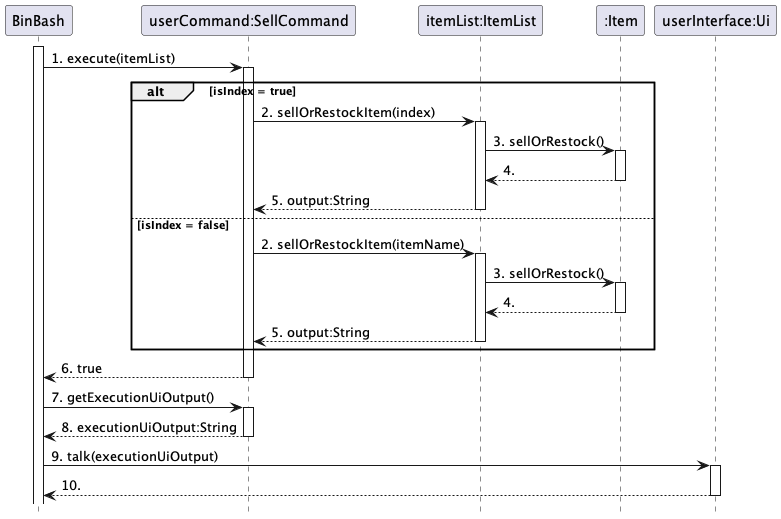
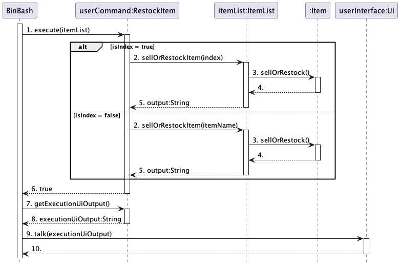

# Syed Iman's Project Portfolio Page

## Project: BinBash

### Overview
BinBash is a CLI-based Inventory Management System that is targeted at small retail business owners. BinBash aims to 
make the inventory management process streamlined, error-free and highly efficient, through its extensive suite of 
inventory management features. BinBash also enables users to gain valuable insights into their inventory, through 
comprehensive profit reporting features which facilitate efficient sales and trends analysis.

The following are my contributions to this project.

### Summary of Contributions

### Features ###

#### 1. Implemented `AddCommand` for users to add items to the inventory

- **What it does:**
  - Allows user to utilise the `add` command to add new items into the inventory list. This is a very basic feature that
  allows users to use the application.
- **Justification:**
  - This is a vital component as users will require a way to access the relevant methods to add items from the
  `ItemList` class. The `AddCommand` class will facilitate in the construction of an `add` command to execute user
  requests.

#### 2. Implemented `sell` and `restock` features

- **What it does:**
    - Allows users to utilise the `sell` and `restock` commands to make increments or decrements to the quantity of
    the items for the respective operations.
    - A `threshold` field is also maintained for all items to track if its quantity falls under it when sold. This 
    generates a warning to alert users that stocks are depleting.
- **Justification:**
    - These are also core components as it facilitates the management of the inventory for business operations.
    - Furthermore, the alert function is a good-to-have feature that automates processes for users as it eliminates the 
    need for manual counting. This helps to optimise their processes.
- **Highlights:**
  - Initially, these features were implemented with the use of item names as the query. However, due to the possibility
  of duplicates, there needs to be a query identifier that is unique. Hence, the method to sell or restock item is
  overloaded to take in either item name or item index. Querying by item name is retained as it can be used to effect
  all duplicates if user wishes to.

#### 3. Implemented `update` feature

- **What it does:**
  - Allows users to utilise the `update` command to make edits to the data of any item.
- **Justification:**
  - This is a basic optimisation for the program as it eliminates the need to delete and create a new entry to fix any
  discrepancies.
- **Highlights:**
  - Similarly, this feature was implemented with the use of item names as the query initially but altered to also take 
  in item index to handle duplicates. 
  - This was particular tricky to implement due to the different nature of items resulting in certain item types having
  unique fields such as expiry date and sale price. As a result, several checks have to be implemented to catch
  exceptions to prevent the program from crashing should an invalid request be given.

### Code Contributed 
- [RepoSense link](#https://nus-cs2113-ay2324s2.github.io/tp-dashboard/?search=imanamirshah&breakdown=true&sort=groupTitle%20dsc&sortWithin=title&since=2024-02-23&timeframe=commit&mergegroup=&groupSelect=groupByRepos&checkedFileTypes=docs~functional-code~test-code~other)

### Documentation 

- **User Guide**
  - Provided content and notes on the different flags that users can use with the commands. 
  - Added elaboration on different item types for the `add` feature.
  - Introduced the `update`, `sell` and `restock` features, including relevant notes and examples.
- **Developer Guide**
  - Described the implementations of the `update`, `sell` and `restock`.
  - Added the sequence diagrams for the above features.

### Team Contributions

- Assisted in creation and management of issues of user stories as well as issues for milestones.
- Assisted in completing some User Guide sections not specific to any feature such as the notes on use of flags.
- Generated the PDF for User Guide for submission.

### Review Contributions
- [List of GitHub pull requests reviewed (filtered)](#https://github.com/AY2324S2-CS2113T-T09-2/tp/pulls?q=is%3Apr+reviewed-by%3Aimanamirshah)

---

## **Contribution to User Guide (extracts)**:

> #### ℹ️ Note:
> - Only one item type flag can be specified for each item. This means that you can only use either `-re` or `-op` but
    > not both at the same time.
> - The `-e` flag should be provided if the item that you are adding is a Perishable item. That is to say, it will expire by
    > the provided expiry date.
> - The `-s` flag should be provided if the item that you are adding is a Retail item. This means that this item is
    > meant to be sold.
> - The flags can be placed in any order. There is no specific order that you have to abide by.
> - Words in `UPPER_CASE` are the arguments that are meant to be supplied by you.
    > For example, in `add -n ITEM_NAME`, `ITEM_NAME` would represent the name of the item you are adding (e.g., `add -n apple`).

---
### Adding an item: `add`

> This allows you to add a new item to start keeping track of in your inventory.

#### Adding a Retail item

Format: `add -re -n ITEM_NAME -d ITEM_DESCRIPTION -q ITEM_QUANTITY -s SALE_PRICE -c COST_PRICE -t THRESHOLD`

* `-re` specifies that this is a Retail item.
* `ITEM_NAME`, `ITEM_DESCRIPTION`, `SALE_PRICE` and `COST_PRICE` must be specified.
* All other fields are optional.
* If `ITEM_QUANTITY` is not specified, a default value of `0` will be assigned to it.
  This allows you to create a placeholder for an item in your inventory you've yet to receive any stock of.
  > ℹ️ Once you've received stock of the item, you can call the [`restock`](#restocking-an-item-restock) command to increase the stocked quantity of the item.
* If `THRESHOLD` is not specified, a default value of `1` will be assigned to it.
* There is no need to include the currency. A `$` sign will be appended to the prices.
* Retail items do not have an `EXPIRY_DATE` field, hence the flag `-e` is not used.

Examples:

- `add -re -n lego -d toys -q 350 -s 102.00 -c 34.32 -t 50` 

- `add -re -n hammer -d tools -q 20 -s 9.00 -c 4.39 -t 10` 

#### Adding a Perishable Retail item

Format: `add -re -n ITEM_NAME -d ITEM_DESCRIPTION -q ITEM_QUANTITY -e EXPIRY_DATE -s SALE_PRICE -c COST_PRICE
-t THRESHOLD`

* The command to add a Perishable Retail item is similar to adding a Retail item.
* An additional flag , `-e`, is used here to include the `EXPIRY_DATE`, hence signifying a Perishable Retail item.
  > ℹ️ Ensure that the provided date is in `DD-MM-YYYY` format. For example, **20 January 2024** is represented as `20-01-2024`

Examples:

- `add -re -n apple -d fruit -q 50 -e 12-12-2024 -s 1.00 -c 0.39 -t 10` 

- `add -re -n tuna fish -d seafood -q 5 -e 02-11-2024 -s 10 -c 4.50` 

#### Adding an Operational item

Format: `add -op -n ITEM_NAME -d ITEM_DESCRIPTION -q ITEM_QUANTITY -c COST_PRICE -t THRESHOLD`

* `-op` specifies that this is an Operational Item.
* `ITEM_NAME`, `ITEM_DESCRIPTION` and `COST_PRICE` must be specified.
* All other fields are optional.
* If `ITEM_QUANTITY` is not specified, a default value of `0` will be assigned to it.
  This allows you to create a placeholder for an item in your inventory you've yet to receive any stock of.
  > ℹ️ Once you've received stock of the item, you can call the [`restock`](#restocking-an-item-restock) command to increase the stocked quantity of the item.
* If `THRESHOLD` is not specified, a default value of `1` will be assigned to it.
* There is no need to include the currency. A `$` sign will be appended to the prices.
* `-s` and `-e` are not used as there are no `SALE_PRICE` and `EXPIRY_DATE` fields for an Operational Item.

Examples:

- `add -op -n light bulbs -d lighting -q 5 -c 2.30 -t 3` 

#### Adding a Perishable Operational item

Format: `add -op -n ITEM_NAME -d ITEM_DESCRIPTION -q ITEM_QUANTITY -e EXPIRY_DATE -c COST_PRICE -t THRESHOLD`

* The command to add a Perishable Operational item is similar to adding an Operational item.
* An additional flag , `-e`, is used here to include the `EXPIRY_DATE`, hence signifying a Perishable Operational item.
  > ℹ️ Ensure that the provided date is in `DD-MM-YYYY` format. For example, **20 January 2024** is represented as `20-01-2024`
* `-s` is not used as there is no `SALE_PRICE` for a Perishable Operational Item.

Examples:

- `add -op -n milk -d to make coffee -q 2 -e 03-10-2024 -c 1.30` 
---

### Selling an item: `sell`

> This allows you to decrement the quantity of an item after it has been sold.

#### Selling an item using item name

Format: `sell -n ITEM_NAME -q ITEM_QUANTITY`

* Both flags `-n` and `-q` are mandatory.
* The flag `-n` is used, meaning that the `item name` is used as an identifier to identify the item you wish to sell.
* The quantity given to this command represents the amount of item that you want to sell. This amount will be reduced
  from the existing quantity of the item in the inventory list.

Examples:

- `sell -n oranges -q 20` This will deduct the quantity of "oranges" in your inventory list by 20.
- `sell -n lego bricks -q 219` This will deduct the quantity of "lego bricks" in your inventory list by 219.

#### Selling an item using item index

Format: `sell -i ITEM_INDEX -q ITEM_QUANTITY`

> ℹ️ To determine the `index` of an item in your inventory, call the `list` command first, and
> note down the number displayed next to your item of interest.

* Both flags `-i` and `-q` are mandatory.
* The flag `-i` is used, meaning that the `item index` is used as an identifier to identify the item you wish to sell.

Examples:
- `sell -i 1 -q 50` This will decrease the quantity of the item at index 1 in your inventory list by 50.
- `sell -i 3 -q 35` This will decrease the quantity of the item at index 3 in your inventory list by 35.

> ℹ️ Note:
> - Only one item identifier flag, `-n` or `-i`, can be used with the `sell` command to identify the item that you want to sell.
> - There must be a minimum of one flag used, excluding the `-n` or `-i` flag.

* [Back to table of contents](#table-of-contents)
---

### Restocking an item: `restock`

> This allows you to increment the quantity of an item after it has been restocked.

#### Restocking an item using item name

Format: `restock -n ITEM_NAME -q ITEM_QUANTITY`

* Both flags `-n` and `-q` are mandatory.
* The flag `-n` is used, meaning that the `item name` is used as an identifier to identify the item you wish to restock.
* The quantity given to this command represents the amount of item that you want to restock. This amount will be added
  to the existing quantity of the item in the inventory list.

Examples:

- `restock -n apples -q 50` This will add the quantity of "apples" in your inventory list by 50. .

#### Restocking an item using item index

Format: `restock -i ITEM_INDEX -q ITEM_QUANTITY`

> ℹ️ To determine the `index` of an item in your inventory, call the `list` command first, and
> note down the number displayed next to your item of interest.

* Both flags `-i` and `-q` are mandatory.
* The flag `-i` is used, meaning that the `item index` is used as an identifier to identify the item you wish to update.

Examples:
- `restock -i 2 -q 10` This will add the quantity of the item at index 2 in your inventory list by 10.

> ℹ️ Note:
> - Only one item identifier flag, `-n` or `-i`, can be used with the `restock` command to identify the item that you
    > want to update.
> - There must be a minimum of one flag used, excluding the `-n` or `-i` flag.

* [Back to table of contents](#table-of-contents)
---

### Updating an item: `update`

> This command allows you to modify the details of an existing item in the inventory. You can identify the item that you want to update, by
> specifying the name of the object, or its index number as displayed in the inventory list.

#### Updating an item using item name

Format: `update -n ITEM_NAME -d ITEM_DESCRIPTION -q ITEM_QUANTITY -e EXPIRY_DATE -s SALE_PRICE -c COST_PRICE
-t THRESHOLD`

* The flag `-n` is used, meaning that the `item name` is used as an identifier to identify the item you wish to update.
  This flag is required.
* Using the `item name` identifier will only update the first occurring item in the list should there be any duplicates.
* All other flags are optional, depending on what details you wish to update.

Examples:
- `update -n banana -d ripe fruit -q 30 -e 10-10-2024 -c 0.50`
  Updates the description of the item named "banana" to "ripe fruit", its quantity to 30, its expiry date to 10 October
  2024 and its cost price to $0.50. Other information remain unchanged.
- `update -n "printer paper" -s 15.00 -t 5`
  Updates the sale price of the item named "printer paper" to $15.00 and its threshold to 5.
- `update -n "chicken sandwich" -q 50 -e 01-01-2025 -t 10`
  Updates the quantity of the item named "chicken sandwich" to 50, its expiry date to 1 January 2025 and its threshold
  to 10.

#### Updating an item using item index

Format: `update -i ITEM_INDEX -d ITEM_DESCRIPTION -q ITEM_QUANTITY -e EXPIRY_DATE -s SALE_PRICE -c COST_PRICE
-t THRESHOLD`

> ℹ️ To determine the `index` of an item in your inventory, call the `list` command first, and note down the number displayed next to your item of interest.

* The flag `-i` is used, meaning that the `item index` is used as an identifier to identify the item you wish to update.
* To know the `item index`, we encourage you to first use the command `list` to find out the index of your item of
  interest.
* All other flags are optional,depending on what details you wish to update.

Examples:
- `update -i 2 -d "office supplies" -s 20.00`
  Updates the description of the item at index 2 to "office supplies" and its sale price to $20.00. Other information
  remains unchanged.
- `update -i 4 -q 10 -c 2.00 -t 2`
  Updates the quantity of the item at index 4 to 10, its cost price to $2.00, and its threshold to 2.

> ℹ️ Note:
> - Only one item identifier flag, `-n` or `-i`, can be used with the `update` command to identify the item that you
    > want to update.
> - There must be a minimum of one flag used, excluding the `-n` or `-i` flag.

---
## **Contribution to Developer Guide (extracts)**:

### Sell item

API: [`SellCommand.java`](https://github.com/AY2324S2-CS2113T-T09-2/tp/blob/master/src/main/java/seedu/binbash/command/SellCommand.java)

The `sell` command allows users to decrement the quantity of their item as they are being sold off. This is done by
specifying wither the `name` or `index` to identify the item they want to sell, as well as the `quantity` that they want
to sell.

The constructor of the `SellCommand` class is overloaded and its behavior differs based on what identifier is
entered. The two constructors are as follows:

* `SellCommand(int index)`: This constructor is used if the identifier is an `int`. The `isIndex` variable will be set
  to true, which indicates that an item should be identified by matching its `index` before updating its data.
* `SellCommand(String itemName)`: This constructor is used if the identifier is a `String`. The `isIndex` variable
  will remain false, which indicates that an item should be removed by matching its `itemName`.

When the `execute()` method from the `SellCommand` class is called, it first checks whether the update identifier is
an index of type `int` or a name of type `String` with the `isIndex` attribute. It will then call the
`sellOrRestockItem()` of the `ItemList` class. This method is also overloaded to take in either an `index` of type
`int` or a `name` of type `String`.

The `sellOrRestockItem()` method then calls the `sellOrRestock()` helper method, which either increments or decrements
the item quantity, depending on what `command` is supplied to it. The method checks whether a valid quantity is supplied
before applying the decrement in the event that the supplied command is `sell`. This means that users will not be able
to sell more than the current quantity. These methods return a `String` to update users of the successful operation and
display the new data of the item.

Upon completion of the update operation, the `execute()` method sets the `hasToSave` flag to `true`,
signaling the need to persist changes to storage.

---

### Restock item

API: [`RestockCommand.java`](https://github.com/AY2324S2-CS2113T-T09-2/tp/blob/master/src/main/java/seedu/binbash/command/RestockCommand.java)

The `restock` command allows users to increment the quantity of their item as they are being restocked. This is done by
specifying wither the `name` or `index` to identify the item they want to restock, as well as the `quantity` that they
to restock by.

The implementation of the `restock` feature as well as the `RestockCommand` class is identical to the `sell` feature and
calls the same methods from the `ItemList` class to perform the restocking operations.

---

### Update item data in inventory

API: [`UpdateCommand.java`](https://github.com/AY2324S2-CS2113T-T09-2/tp/blob/master/src/main/java/seedu/binbash/command/UpdateCommand.java)

The `update` command allows users to modify the details of an item in the inventory. Users can update the item's,
description, quantity, cost price, sale price, expiry date, and threshold by specifying the corresponding flags.

The constructor of the `UpdateCommand` class is overloaded and its behavior differs based on what identifier is
entered. The two constructors are as follows:

* `UpdateCommand(int index)`: This constructor is used if the identifier is an `int`. The `isIndex` variable will be set
  to true, which indicates that an item should be identified by matching its `index` before updating its data.
* `UpdateCommand(String itemName)`: This constructor is used if the identifier is a `String`. The `isIndex` variable
  will remain false, which indicates that an item should be removed by matching its `itemName`.

When the `execute()` method from the `UpdateCommand` class is called, it first checks whether the update identifier is
an index of type `int` or a name of type `String` with the `isIndex` attribute.
- If it is an index, it calls the `updateItemDataByIndex` method from the `ItemList` class.
- If it is a name, it calls the `updateItemDataByName` method instead.

These methods in the `ItemList` class then call the `updateItemData` helper method, which applies the updates to the
specified item. The `updateItemData` method checks whether each attribute has a new value and updates the attribute
if necessary by calling the respective setters. For perishable items, it ensures that the expiry date is only updated
if the item is a `PerishableOperationalItem` or a `PerishableRetailItem`.

Upon completion of the update operation, the `execute()` method sets the `hasToSave` flag to `true`,
signaling the need to persist changes to storage.

#### Implementation Notes

Similar to other commands, the `UpdateCommand` class is designed to encapsulate the update operation, ensuring a clear
separation of concerns. It handles the update logic internally and interacts with the `ItemList` class without revealing
the details of the item's data structure. This modular approach  streamlines the roles of the `Parser` and `BinBash`
(main) components, which do not need to be concerned with the details of the update operation, thus adhering to the
principles of high cohesion and low coupling.

The incorporation of a helper method `updateItemData` in the `ItemList` class enhances code reusability and
maintainability by centralizing the logic for updating item attributes. This method can be readily adjusted or expanded
to include new attributes or validation rules in the future.
