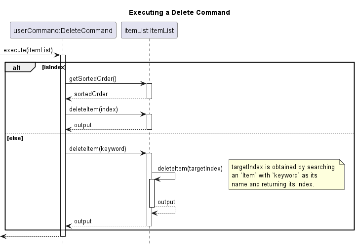

# PureUsagi's Project Portfolio Page

## Project: BinBash

BinBash is a CLI-based **Inventory Management System** that is targeted at small retail business owners.
BinBash aims to make the inventory management process streamlined, error-free and highly efficient, through its 
extensive suite of inventory management features.
BinBash also enables users to gain valuable insights into their inventory, through comprehensive profit reporting 
features which facilitate efficient sales and trends analysis. 

Given below are my contributions to the project.

### Summary of Contributions:
* **New Feature**: Added the `delete` command to remove items.
  * **What it does**: Allows the user to remove one item from the inventory at a time. The item can be identified using its
id shown by the list command or the name of the item.
  * **Justification**: This feature is vital to the product as it allows users to remove items that are no longer being kept
in their inventory, reasons can include: no longer being sold due to poor sales or items have expired and need to be
disposed of. 
* **New Feature**: Added the sorting functionality for the `list` command.
  * **What it does**: Allows the user to specify the order of how items should be shown by the list command. The user can 
specify whether the list is sorted by cost price, sale price or expiry date. Additionally, the index of items shown in
the sorted list can also be used as references for other commands like `delete` or `update`.
the sorted list can also be used as references for other commands like `delete`, `update` `sell` or `restock`.
  * **Justification**: This feature improves the readability by allowing it to be sorted in a way that is desired by the
user. In situations where the inventory is very large, the user cannot be expected to scroll through the unsorted list
just to find a few items. Sorting the list is a quality-of-life feature that greatly enhances the experience of the 
user when using the product.
  * **Highlights**: This implementation requires an overhaul of the existing list feature and also affects the 
`delete` and `update` commands due to the changes on the item indexes displayed to the user.
As such, the implementation requires a full understanding of how indexes are used in the product and necessary measures 
are taken to ensure that the implementation of the sort feature does not affect the correctness of other commands. The 
implementation was also challenging as changes to key classes such as the parser had to be made, which required the 
understanding of how the 3rd party was integrated into the product and had to be replicated for the sorting 
implementation.
* **New Feature**: Added logging class to generate logs to a log file.
  * **What it does**: Allows developers to easily create logs when adding code to the repository which automatically 
saves them in the log file.
  * **Justification**: Developers may want a way to easily write logs to a log file without the need to handle 
functionality and exceptions in the default Java logger.
* **Code contributed**: [RepoSense link](https://nus-cs2113-ay2324s2.github.io/tp-dashboard/?search=pureusagi&breakdown=true)
* **Contributions to the UG**:
  * `delete` command section.
  * `list` command section.
* **Contributions to the DG**:
  * `delete` command section and sequence diagram.
  * `list` command section and sequence diagram.
  * Logging section.
* **Contributions to team-based tasks**:
  * Set up the team/org repo.
  * Release of v1.0 of the product.
  * Assist in issue management.
  * Assist in reviewing and approving GitHub pull requests.
  * Updating user/developer docs that are not specific to a feature.
    * Edit the target user section of the developer guide.
    * Edit the value proposition section of the developer guide.
    * Edit the command summary section of the user guide.
    * Add section delimiters using horizontal rules of the user guide.
    * Add links to the table of contents at the end of each section of the user guide.
* **Review contributions**:
  * [List of GitHub pull requests reviewed (filtered)](https://github.com/AY2324S2-CS2113T-T09-2/tp/pulls?q=is%3Apr+is%3Aclosed+reviewed-by%3APureUsagi+-author%3APureUsagi+)

---

## **Contribution to UG (extracts)**:

#### List Inventory (Unsorted)

View the inventory in the order items were added:

Format: `list`

#### List Inventory (Sorted)

BinBash also allows you to sort your inventory in ascending order based on different criteria. This means that items 
with the lowest 'values' will be showed first, whilst items with the highest 'values' will be showed last. The different
'values' that BinBash can sort by can be seen below:

| Flag | Description                                |
|------|--------------------------------------------|
| `-c` | Sort by cost price                         |
| `-s` | Sort by sale price                         |
| `-p` | Sort by profit                             |
| `-e` | Sort by expiry date (for perishable items) |

Format: `list -FLAG`

Example: 

Suppose you have the following items in your inventory:
- Item A (Perishable Retail), Cost Price: $5, Sale Price: $15, Expiry Date: 01-05-2023
- Item B (Perishable Retail), Cost Price: $10, Sale Price: $12, Expiry Date: 15-04-2023
- Item C (Perishable Operational), Cost Price: $3, Expiry Date: 10-07-2023
- Item D (Non-perishable Retail), Cost Price: $7, Sale Price: $14

Using `list -c`, BinBash sorts all items by cost price in ascending order:
- Item C, Cost Price: $3
- Item A, Cost Price: $5
- Item D, Cost Price: $7
- Item B, Cost Price: $10

Using `list -e`, BinBash sorts the items in order of which items will expire first. Notice how BinBash will filter out 
non-perishable items (Item D) and sort the remaining items by their expiry date:
- Item B, Expiry Date: 15-04-2023
- Item A, Expiry Date: 01-05-2023
- Item C, Expiry Date: 10-07-2023

Similarly, you can use `list -s` to sort the items by sale price and `list -p` to sort by profit. Once again, 
note that for sorting the items by sale price and by profit, operational items like Item C will not appear in these 
sorted lists as they do not have a sale price.

Note: Some edits to formatting and wording are done by teammates.

---

### Deleting an item: `delete`

> This lets you delete an item from the inventory. You can identify an item by its name, or its index number (as displayed in the inventory list).

#### Deleting an item using item index

Format: `delete -i ITEM_INDEX`

> ℹ️ To determine the `index` of an item in your inventory, call the `list` command first, and note down the number displayed next to your item of interest.

* `ITEM_INDEX` must be specified.
* `ITEM_INDEX` specified must exist in the inventory, otherwise no item will be deleted.
* Index of items can be viewed using the `list` command.

Examples:
- `list` followed by`delete -i 1` Deletes the item with index of 1.

#### Deleting an item using item name

Format: `delete -n ITEM_NAME`

* `ITEM_NAME` must be specified.
* `ITEM_NAME` specified must be the exact name of the item.
* `ITEM_NAME` is case-sensitive. Capital letters are treated differently from lower case letters, e.g "apple" is different from "APPLE"
* If there are no items with item names matching `ITEM_NAME`, no items will be deleted.
* If there are items with the same `ITEM_NAME`, only the first instance of item with `ITEM_NAME` will be deleted.
* Item names of items in the inventory can be viewed using the `list` command.

Examples:
- `list` followed by `delete -n cookie` Deletes the first item named "cookie".

> ❗Item name is case-sensitive. So items with names as "COOKIE", "Cookie", etc.  will not be deleted.

- `list` followed `delete -n tissue paper` Deletes the first item named "tissue paper".

> ❗Item name is case-sensitive. So items with names as "TISSUE PAPER", "Tissue Paper", etc. will not be deleted.

Note: Some edits to formatting and wording are done by teammates.

---

## **Contribution to DG (extracts)**:

### Delete command

API: [`DeleteCommand.java`](https://github.com/AY2324S2-CS2113T-T09-2/tp/blob/master/src/main/java/seedu/binbash/command/DeleteCommand.java)

The `delete` command deletes an object of the `Item` class or any of its subclasses from the inventory list and
prints a formatted message stating the details of the items that was deleted.

The constructor of the `DeleteCommand` class is overloaded and its behavior differs based on what search parameter is
entered. The possible constructors are:

* `DeleteCommand(int index)`: This constructor is used if the search parameter is an `Integer`. The `isIndex` variable
  will be set to true, which indicates that an item should be removed by matching its `index`.
* `DeleteCommand(String keyword)`: This constructor is used if the search parameter is a `String`. Conversely,
  the `isIndex` variable will be set to false, which indicates that an item should be removed by matching its `name`.
  Note that the keyword specified is case-sensitive

When the `execute()` method from `DeleteCommand` class is called, it first checks whether the search parameter entered
is an `Integer` or a `String` using the `isIndex` variable. Once the search parameter is checked, it calls the
`deleteItem` method of the `ItemList` object passed as a parameter to the `execute()` method.

Similar to the `DeleteCommand` constructor, the `deleteItem` method of the `ItemList` class has different behaviors
based on the data type of the parameter passed. The implementation is done by overloading the `deleteItem` method and
having one `deleteItem` method take in an `Integer` and another taking in a `String`.
* If the parameter is an `Integer`, the `deleteItem(int index)` method will call the `remove` method of the `ArrayList` class to
  remove the item from the inventory list.
* If the parameter is a `String`, the `deleteItem(String keyword)` method will run a `for` loop to iterate through the `ArrayList`
  until it finds a `Item` object whose name `equals` to that of the search parameter. If an `Item` object has matching
  names with the search parameter, it will store the index in the `targetIndex` variable. This `deleteItem(String keyword)` method will
  then call another `deleteItem(int index)` method, but this time, the parameter passed is an integer. The execution after this
  will be exactly the same as passing an `Integer` to the `deleteItem(int index)` method mentions above.

Furthermore, the `deleteItem(int index)` method will be accessing a `ArrayList<Integer>` called `sortedOrder` which contains
the index mapping between the `Item` objects stored in `itemList` and the index of `Item` printed to the user. This
functionality is implemented to ensure that the indexes of the sorted list shown to the user can be used as references
for the deletion of items using `ITME_INDEX`.

Example:

* For itemList = {item1, item2, item3, item4}
* If sortedList = {item2, item4, item1, item3}
* then sortedOrder = {1, 3, 0, 2}

Upon completion of either operation, the `execute()` method sets the `hasToSave` flag to true, signaling the need to persist changes to storage. This entire process is logged at various levels, providing a trail for audit and debugging purposes.

---

## Logging

Logging plays a crucial role in providing insights into the runtime behavior of the application and diagnosing issues. In this project, we utilize the `java.util.logging` package for comprehensive logging functionality.

---

### List command

API: [`ListCommand.java`](https://github.com/AY2324S2-CS2113T-T09-2/tp/blob/master/src/main/java/seedu/binbash/command/ListCommand.java)

The `ListCommand` class is designed to handle the operation of listing all items in the inventory. When the `execute()`
method is called, it retrieves the complete list of items from the `ItemList`
and assigns it to `executionUiOutput`.

A sorting functionality is implemented within the `list` command. Depending on which flag is set, the list of
`Items` retrieved will be sorted in a certain order based on the specified flags.

- `list` retrieves the list of `Item` without sorting.
- `list -c` retrieves the list of `Item` sorted based on `itemCostPrice` value.
- `list -e` retrieves the list of `Item` sorted based on `itemExpirationDate` value. Only items of the `PerishableOperationlItem` and `PerishableRetailItem` classes are retrieved.
- `list -p` retrieves the list of `Item` sorted based on `totaRevenue - totalCost` value. Only items with of the `RetailItem` class are retrieved.
- `list -s` retrieves the list of `Item` sorted based on `itemSalePrice` value. Only items of the `RetailItem` class are retrieved.

The `ListCommand` has two constructors, `ListCommand()` and `ListCommand(SortOptionEnum)`, the former is used when no sorting
is specified, the latter is used when the list is to be sorted where `SortOptionEnum` will be the type of sorting used.
The `ListCommand()` constructor will set the `sortOption` varialbe to `SortOptionEnum.NONE` while the `ListCommand(SortOptionEnum)`
will set `sortOption` based on the `SortOptionEnum` value passed into hte constructor.

The enum `SortOptionEnum` contains four values `NONE`, `EXPIRY`, `SALE`, `COST`, `PROFIT`
- `NONE` List not to be sorted
- `EXPIRY` List sorted based on `itemExpirationDate` value.
- `SALE` List sorted based on `itemSalePrice` value.
- `COST` List sorted based on `itemSalePrice` value.
- `PROFIT` List sorted based on `totaRevenue - totalCost` value.

When the `execute(ItemList)` method is called, it first retrieves a `List` from the `ItemList` object passed that will
contain all `Item` objects in the inventory. The execution will then defer depending on the `sortOption` value, which
can be referenced in the sequence diagram provided above.

To ensure that the index of items in the printed list can be used as `ITEM_INDEX` values for the `update`, `delete`,
`sell` and `restock` commands, an `ArrayList<Integer>` called `sortedOrder` will be used to map the indexes of the
items printed to their indexes in `itemList`. `sortedOrder` will be updated on startup, adding of items, deleting of
items, and listing of items to ensure that the mapping is always accurate when it is referenced.
* **Review contributions**:
  * [List of GitHub pull requests reviewed (filtered)](https://github.com/AY2324S2-CS2113T-T09-2/tp/pulls?q=is%3Apr+is%3Aclosed+reviewed-by%3APureUsagi+-author%3APureUsagi+)